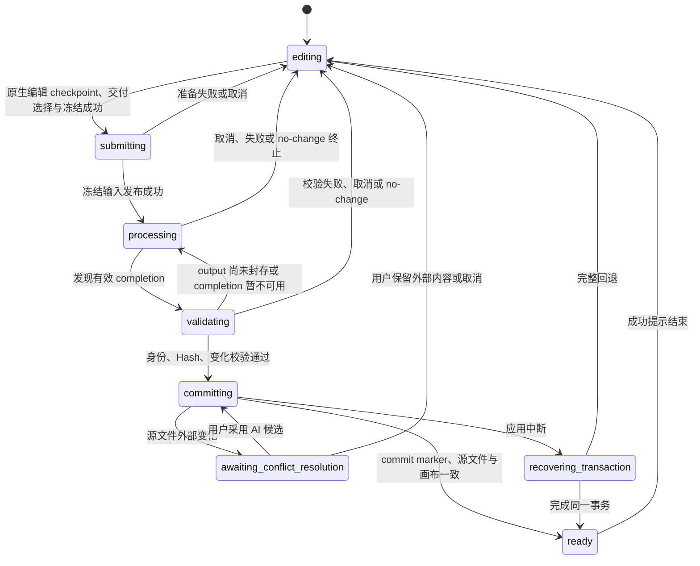

# PageRoot 交互流程

- 状态：v3 源码级定点修改合同；桌面打开边界为 v4-only；项目管理面板已下线，项目/版本事实仍以 v4 专项 PRD 为准
- 上位文档：[架构说明](ARCHITECTURE.md)
- 安全边界：[安全模型](SECURITY_MODEL.md)
- 产品范围：[MVP 产品需求](MVP_PRD.md)
- 文件协议：[Change Request 协议](CHANGE_REQUEST_PROTOCOL.md)

本文只描述目标流程。旧 0.5.x 中“手动保存建版”“稳定 HTML 自动完成”“恢复历史时复制为新版”“处理时锁住全部项目”等行为均不属于目标交互。

## 1. 用户心智模型

用户只需要理解这些事：

1. 我在当前 HTML 上直接编辑，系统自动更新文件。
2. 我在设置里接通 Agent，在侧栏把评论交给它或复制给别的 AI；接通成功后工作台才把当前内容和评论冻结成 AI 任务，只有冻结成功，当前项目才会锁住。
3. AI 真正完成且产生有效变化后，系统先保留独立 Candidate 并让我审阅；只有我明确采纳才切换到下一份 HTML，不会覆盖提交前的文件。
4. 修改前完整 HTML、修改后新工作文件和不可变历史 HTML 都会保留。
5. 编辑画布上：单击选择，双击改字；需要点页面自己的按钮或脚本交互时切到“预览”。部分 Tab 等源码可证明的切换在编辑里也能做，不必为它们切预览。
6. 动态内容无法运行而静态源码页面仍可编辑时保持安静，不显示常驻警告；可重试的临时失败在“更多”菜单提供“重新加载动态内容”，先保护当前修改再重试，不支持的程序不提供无效重试。动态与静态 Candidate 都失败时保留上一张可用画面为只读，顶部提示“页面暂时无法编辑”，持续提供重新加载和导出。重新读取磁盘只属于加载过程；画布核对同一源 Hash 并释放编辑锁后才提示“页面已重新加载，可以继续编辑”。即使动态准备失败，新静态画布核对成功也必须解除旧画布的只读降级。Candidate 准备期间保留当前图表与滚动位置，文字输入和中文组词尚未结束时不切换 iframe。

页面不要求用户区分临时文件、写入队列、事务目录或 commit marker；保存事实通过标签状态点、全局错误提示和对应工作流动作表达，顶栏不重复显示。

> PR 2B 覆盖本文件中较早的项目目录/Finder 细节：Registry 决定项目列表成员，Recent 只排序；项目 Finder 打开验证后的项目根，历史 Version Finder 定位可见 Working Copy，Candidate Finder 只打开 `AI任务/` 派生目录。`.pageroot/requests/...` 不是产品入口；可见附件、附件 Finder 定位与回收区属于 P3。

## 2. 顶层导航

工作台包含：

- 顶部是浏览器式双层骨架：第一层是全局标签栏，第二层是编辑、预览与审阅共用的
  单行紧凑工具栏。全局项目侧栏占据产品最左侧的完整高度；展开时标签、工具栏与内容整体右移，
  收起时只在系统红黄绿按钮旁保留唯一的侧栏开关。标签状态点只投影正常、AI 处理中、待审阅与错误；
  不复制 Request/Candidate/Version 状态。「+」创建独立开始标签。开始页无整页卡片外框，
  不复制左侧项目列表；它只展示最近可继续的一个 Registry 项目、当前真实存在的
  可操作待办，以及唯一的「新建项目」入口。待办当前只投影 Registry 已证明的待审阅
  Candidate，最多默认展示三条，解决后自动消失；没有待办时不留空标题。
- 一个 `projectId + documentId` 在标签栏中最多出现一次。切换文档标签必须经过现有
  `ProjectWorkflow` 的安全收口；同一 Controller 原先保留的身份不能冒充本次打开结果。新 epoch
  的权威 HTML 字节发布后立即挂载内容出口并释放下一次标签导航；评论、版本、运行态和最终编辑画布
  在后台继续核对，未完成前只锁住编辑能力，不用空白页遮住 HTML。后台核对失败时保留已打开页面并把
  标签标成错误，不把“能看到页面”伪装成打开失败。全应用仍只有一套
  `WorkspaceController` 和一个挂载的业务文档；最近三个标签可保留脚本禁用、只读且无序列化能力的
  显示 iframe，较早标签在 48 MiB / 8 项预算内保留精确 HTML 与滚动/页面视图投影，超出预算只保留身份。
  切回缓存标签先显示页面，再由正常 Registry/OpenTarget 打开链路核对并接管；非活动标签绝不保留
  contenteditable、Selection、IME、编辑观察器或保存权威。活动文档始终挂载唯一
  `HtmlCanvasEditor`：脚本刷新只在编辑器内部短暂 A/B Candidate 完成，不得在 Runtime
  preparing 时整页换成静态 Surface，也不得让同一文档的 Cache 挡住文字输入。
  采纳新 Version、从磁盘重载或恢复历史时，工作台推入的新 HTML 先写入 Active
  静态帧并完成画布核对，再在同一编辑器内做 Runtime A/B；不得把整份新源码只丢进
  隐藏 Candidate 而让 Active 继续显示上一份 HTML。同一已挂载文档保留最小视口锚点
  （Stable ID、屏幕偏移、外层滚动），不恢复 Caret、Range 或原生编辑会话；切到不同
  文档或项目时使用该标签保存的滚动或默认顶部。评论栏把共享滚动台对齐到标记时，
  不得覆盖这份阅读位置，以免随后的同文档权威 HTML 更新跳回顶部。
  从活动开始页继续项目、处理待办或新建项目时，该开始标签原位变成目标文档；只有用户明确点击「+」
  创建的其他开始标签会保留。若目标文档已存在，则移除当前空白标签并聚焦已有标签。
- 关闭标签不删除项目、对话、Candidate 或后台 AI 任务。关闭活动文档标签先为当前 revision 取得源文件写回或已读回校验的恢复保护，再原子移除当前标签，最后打开后继标签；后继打开失败时进入开始页，不复活已关闭文档。
  最后一个标签关闭后进入开始页。Finder/Open With 再次打开已有文档时聚焦已有标签，
  新文档则建立标签；多个外部打开请求按 FIFO 交付，不静默覆盖。主进程只发送队首，renderer
  在直接接受、确认接受、取消或终态拒绝后显式回执，主进程才发送下一条；确认框不会被后到请求替换。
  若业务动作已提交而回执失败，renderer 保留同一请求的完成态，只重试回执，绝不重复导入、打开或提交，也不放行后继。
  每个已接受项目都在 `project-applied` 当下以 Desktop/Bridge 已验证的
  `projectId + documentId` 逐条建立标签；即使 A、B 在同一次 React 批处理中连续发布，也保留 A 并聚焦 B，
  不以路径推导身份，也不等待最终 aggregate 才创建标签。
  纯浏览器文件输入在读取内容后以文件名、大小、修改时间和内容 Hash 的版本化摘要生成稳定轻量身份；
  从开始页打开时原位成为文档标签，重选同一文件去重，同内容不同文件名不会误合并。该摘要不授予本地路径或源码持久化权威。
- 标签栏采用 roving focus：左右方向键循环移动并激活，Home/End 到首尾；安全切换失败时焦点和活动
  文档不伪装成已切换。键盘关闭活动或非活动标签后，焦点转移到仍活动的后继标签。标签数量不设产品上限；
  活动开始页仍作为目标文档的同一标签原位打开。

### 工具栏、项目上下文与设置

- 左侧栏是全局项目上下文，固定分为标题栏、品牌区、可滚动项目列表和底部固定操作区。项目列表只有一个“项目”分组：当前项目与 Registry 项目按真实 `projectId` 去重后混合展示，并按权威内容更新时间倒序排列；打开项目不会改变排序。每个项目独立维护展开状态，多个项目可以同时展开，展开或收起不会切换当前项目，也不会读取 HTML 正文、评论或附件。当前项目下的长期规则与版本列表摘要仍可从左侧进入既有安全导航。品牌区打开 About，底部齿轮在标签栏中打开设置。
- 第二层工具栏只承担模式、审阅筛选/视图、文件动作和 AI 入口。顶栏不提供“项目”按钮、项目管理入口，也不显示保存状态点、写入中、冲突或失败文字；保存/冲突事实继续由 Document/Project 工作流、标签状态点和全局错误提示承载。刷新与更多图标保持 20px 视觉盒、30px 点击区，顺序为“刷新 → 上轮处理（有时）→ AI 助手 → 更多”。
- “在文件夹中打开”和“在默认浏览器中打开”仍是当前 HTML 的文件动作。纯浏览器预览没有本地文件权限，因此只展示禁用态。失败显示可恢复的全局错误，不通过顶栏重复呈现。
- Review 中顶栏刷新只“刷新本页面”：重载两侧隔离 Runtime，并在同一 session 身份核对后恢复当前 Tab/折叠、筛选、聚焦、滚动与缩放，不读取磁盘新源。更多菜单中的“从磁盘重新载入 HTML”在待决定 Review 期间保持可见但禁用，并就近说明必须先采用或不用本次 AI 修改；两条刷新语义不得互相替代。
- 项目身份、Registry、长期规则、Version、Candidate 和历史 HTML 仍由对应事实与工作流持有。当前项目下的“长期规则”入口不属于版本时间线；点击后在工作区打开唯一规则标签页，重复点击只聚焦。规则页支持基础 Markdown、700ms 自动保存和 `⌘S` 立即保存，保存状态只在编辑器原位安静显示。内部保存文件名与协议保持不变，但不向用户展示。AI 任务开始时由 Request freeze 读取并冻结规则快照，任务期间编辑只影响下一次任务；恢复或切换 HTML 历史版本不回滚该文件。
- 左侧版本列表只读取只读版本摘要，主列表固定按 V1、V2…Vn 序号排列；继承来源保留在悬停详情，当前编辑与最新版本分别标记，不再绘制多轨道或分支连线；点击具体 HTML 文件进入既有项目打开/切换流程。历史默认使用独立只读预览，当前工作内容和草稿保留在原会话。返回当前仅结束历史展示并核对外部文件变化；历史加载失败保留原视图和关闭出口。版本数据链不依赖任何面板容器。
- 设置是一个普通标签页，不是弹窗。设置模式下左侧栏只显示“返回工作台”“常规”“AI 服务”“软件更新”，Canvas 一次只渲染一个类别；点击其他文档标签恢复项目栏，返回按钮或 `Escape` 关闭设置标签并把焦点还给原入口。齿轮在新进入设置时打开“常规”，再次打开复用唯一设置标签；从 AI 安装/登录引导进入时打开“AI 服务”并聚焦对应动作。设置页打开时触发 Agent 可用性检查，并在未解决状态返回前台时复查；更新后台控制器、侧栏 New! 和重启确认保持原有生命周期。普通设置页不套用模态 Tab 焦点循环。
- 常规设置只包含面板宽度记忆、恢复默认布局、动态效果和启动时恢复标签页；AI 服务设置列出内置 AI、Qoder 和 Codex 三行，一次最多展开一个接入面板，也可以全部收起，收起后不会被默认服务重新撑开。默认服务与侧栏一致；浏览或展开某行不改变默认，只有该行的“设为默认”才切换，不再使用顶部选择器。源页 Agent 默认 DeepSeek 填 API Key，动作用“连接 / 更换 API Key”；Qoder/Codex 安装或官方登录。展开区只放配置、状态说明和必要动作，不再重复外层服务名。默认服务可为源页、Qoder 或 Codex，重启后仍恢复该选择，不会把源页静默改回 Qoder；显式断开后也不把默认服务改成另一家。更多菜单承载断开、移除 API Key；断开会保留凭据，移除 Key 后需要重新填写。断开、退出或移除会按该服务在所有打开文档上的相关任务数确认，确认区显示处理中并等到结果返回才收起；无任务时的失败也留在确认区，不报成功。用户请求取消不等于系统已确认停止；登录清理失败保持“停止未确认”，不能显示为已取消或已登录。当前进行中的安装/登录与上一次操作结果分开投影，安装不能被旧登录终态盖住。会话清理失败不会报成功。断开后只要本机仍记住 Key，仍可移除。勾选记住但安全存储失败时保持连接表单，标明仅本次可用并允许单独“重试保存”，不必再验证连接；面板按 provider/runtime 保持稳定身份，普通连接或模型更新不重建表单。Custom 记住时同时保存非敏感 Model ID。侧栏只显示设置中的默认 Agent，不提供服务选择器；默认服务未接通时，主操作打开该服务的设置。设置页接通备用服务不改变默认。侧栏就绪名称来自当前连接摘要，不把所有源页服务写成 DeepSeek。Key 失效时原位打开更换表单，连接恢复后需明确重新发送；换 Key 后重新发送只继续原来那一轮，切文件保留修复意图但不把任务发到另一文件，同文档已开始新轮次则结束旧修复。显式断开写入 `disabledAgentProviderIds`，后台扫描或本机 CLI 仍登录都不能自动重新启用。安装/登录/连接验证操作有独立 `operationId` 与代次；关闭设置页不等于取消，返回后恢复同一个进行中操作，已结束的取消不能覆盖新操作。软件更新设置复用现有更新控制器并只保留一个检查/下载/重启主操作。工作台偏好由主进程的 v2 `ui-preferences.json` 持有，设置页只通过窄 IPC 读取和提交已 allowlist 的字段；宽度始终经过 200–420px / 280–520px 约束，拖动期间不逐帧写盘。关闭“启动时恢复上次标签页”时进入开始页，但外部打开优先，当前会话仍继续记录最新标签状态。源页 Agent 的会话 Token 只存在于 Bridge 进程内存；只有用户明确勾选记住后才由 Main 以 `safeStorage` 密文保存，不明文写入 `ui-preferences.json`。 DeepSeek 默认模型 `deepseek-v4-pro` 对正式安装包可见，无需 Beta/E2E 开关。产品可见不等于真实协议已验收；`shared/agent-protocol-acceptance.mjs` 仍把 DeepSeek、Qoder、Codex 及 Beta HTTP 厂商记为未验收。source-gate 与 Candidate 证明必须写入当前 commit、包版本和平台，并列出未验收项；CI mock 不能把任何一行写成 accepted，也不能代替 `smoke:agent-vendors:real` 或干净机器首轮。
- About 只介绍源页产品、版本、架构、GitHub 和用户声明，不触发 Agent 检查，也不承载登录、连接状态或软件更新。点击品牌或 macOS“关于源页”都进入 About；About/设置均支持遮罩或 Escape（设置为标签页关闭）、焦点约束和关闭后焦点回归。
- 审阅工具保留“全部/文字/元素”、双页/修改前/修改后、同步或独立滚动、缩放和页面变化入口。
  上下文可见度移到“设置 → 常规”，变化聚焦与评论聚焦分别保存，默认 25% / 15%。共享顶栏提供
  可展开的“变化 N 处”目录；页边只保留低噪声位置提示，不提供上一处、下一处或重复计数导航。
  第一次进入只自动定位第一处变化一次，不激活遮罩或边框。
- 主界面、文件菜单、原生菜单和右键菜单均不提供独立的“保存为 Version”动作。打开或切换 HTML 统一走左侧栏、开始页或外部打开的安全项目流程。

## 3. 项目级状态机



状态含义：

| 状态 | 当前项目 | 允许动作 |
|---|---|---|
| `editing` | 可编辑 | 直接编辑、评论、提交、历史查看/恢复、导出 |
| `submitting` | 已锁定 | 被动查看冻结页面与状态、取消、切换其他项目 |
| `processing` | 已锁定 | 被动查看冻结页面与状态、取消、切换其他项目 |
| `validating` | 已锁定 | 查看校验进度、取消、切换其他项目 |
| `committing` | 已锁定 | 查看提交进度、切换其他项目 |
| `ready` | 已解锁 | 查看本轮变化、开始下一轮 |
| `awaiting-conflict-resolution` | 已锁定 | 比较、采用 AI、保留外部、取消、切换其他项目 |
| `recovering-transaction` | 已锁定 | 查看恢复进度、切换其他项目 |

锁只属于一个 `projectId`。处理 A 项目时，用户仍能打开、切换和编辑 B 项目。

### 3.1 首次启动欢迎项目

桌面应用没有可恢复的当前项目时，不显示一个只有内存内容的假预览。系统会在所选工作区的上级目录建立 `欢迎来到源页.html`；默认位置是 `~/Documents/PageRoot/欢迎来到源页.html`，并立即：

1. 把它作为普通当前 HTML 加入最近项目。
2. 通过 Bridge 登记独立的 `projectId`、`documentId` 和初始 V1。
3. 按与用户打开 HTML 相同的源码写回、评论、附件、Request、QoderWork 交接和版本流程运行。

欢迎 HTML 只在文件不存在时写入；模板以用户语言介绍直接编辑、AI Agent 交接和“修改前后对照、审阅后再决定”的结果流程，并用与正式审阅界面一致的文字与元素变化语义展示双页示意。模板引用的 `brand-logo.png` 同时以受管普通文件写到 HTML 同级目录，桌面首次打开不得显示断图。用户对欢迎 HTML 的修改、AI 新版和项目记录在重启后继续保留，应用不得用内置模板覆盖。已有当前项目时仍优先恢复该项目，不额外创建或切换欢迎项目。纯浏览器预览没有桌面文件权限，继续使用只存在于内存中的欢迎内容和公开品牌图。

正式签名 App 首次访问 `Documents` 时，macOS 权限确认可以暂停本地工作区
服务启动。只要服务进程仍在运行，系统保持同一次启动并等待其明确 `ready`；
用户完成权限选择后自动继续打开工作台，不显示“启动超时”、不要求重启，
也不把尚未就绪的端口交给 Renderer。只有服务在 `ready` 前真实退出或报告
启动错误时，才进入原生启动失败流程。

### 3.1.1 编辑画布中的 Hover 提示

同一编辑画布上，指针立即改光标；在同一逻辑原位编辑宿主上稳定悬停约 80ms 后，
浅轮廓与一行说明同时出现。说明默认位于目标轮廓左上方并留出明确间距，顶部空间
不足时移到轮廓下方，且始终限制在画布横向范围内；快速掠过不显示任何 Hover
装饰。
文案只有三句，且必须复用真实进入文字编辑的证明
（`nativeEditHostForElement` / `isEditableIslandTarget`），不能按标签名猜测。按钮里可安全改的字
优先「双击文字直接编辑」。能映射到源码目标时「单击选择并评论」，否则
「可添加评论交给 AI」。选中且工具条可见时仍更新光标，但不再叠 Hover
轮廓或文案。说明贴在当前命中轮廓内侧，不是按钮；点标签所在像素等于点该目标。

指针下的精确命中、Canonical Target、Visual Target、轮廓、文案和单击结果来自同一个
`resolveCanvasTarget`。点在普通文字的 `strong` / `em` / `span` / `a` 上时，精确命中
仍用于光标和 Option-click，但单击、评论、AI 与结构操作提升到同一个文字宿主，Visual
Target 决定完整宿主的选框；点在有内容的模块自己的 padding、边框或分栏间隙上选该模块；
完全没有元素子节点且没有非空白文字的模块不选中、不 Hover。`html` / `body`
仍是页面根，单击清除。没有「预览模式下可操作」这一档 Hover；编辑模式里部分
Tab 已经能操作，不为此增加眼睛徽章或工具栏「去预览」按钮。
预览模式、欢迎页和锁定画布不显示 Hover。

### 3.2 纯浏览器预览

纯浏览器预览是正式产品能力，但边界固定为只读：

- 默认进入“预览”，不能切换到“编辑”。
- PageRoot 的直接编辑、评论、附件、项目持久化和“发给 AI”均不可用。
- 页面自身的脚本、表单与交互可以在 sandbox 内运行；顶部持续显示“浏览器预览 · 只读”“操作不会保存”。
- 离开预览不弹“是否保存”，因为 PageRoot 从未接受可写修改。

### 3.3 桌面交互预览与“编辑当前页面”

桌面版仍只有“编辑 / 预览”两种模式，不增加分屏或第三种模式：

1. “编辑”从当前权威源码构建画布。桌面端遇到已持久化且具有受支持
   `script` 程序的页面时，主进程先核对路径、Hash、generation 和资源预算，
   再准备作用域受限的资源闭包。可见 Edit iframe 执行受支持的 parser-blocking、
   inline、`defer`、无 import module、`DOMContentLoaded` listener 与受控相对
   `<base>` 页面；PageRoot 不等待“静默帧”，不冻结 timer/listener/
   Observer/动画，也不把 Runtime DOM 与源码逐节点对账。不支持的 module import
   graph 等不能等价执行的程序会关闭到禁用脚本的静态画布，不能把
   iframe load 当成脚本已运行。Edit 始终不使用截图、位图投影
   或隐藏执行探针冒充作者页面。最小模块识别只拒绝真实静态/动态
   import；字符串、注释、正则、属性/私有名和 `import.meta` 元信息不等于加载依赖。
2. 点击“预览”后，当前 HTML 在独立隔离文档中像普通页面一样运行。
   页面脚本、相对资源、Tab、表单、SVG、Canvas 和动态表格可以工作；
   相对资源继续从首次导入时的原稿目录读取。编辑画布为这些静态资源
   复用同一个 `pageroot-preview` 会话，自动保存只刷新声明资源、不新开
   会话；会话表满时按最近访问淘汰空闲会话。
   页面不能导航宿主窗口或获得 PageRoot 的文件、编辑、评论和 AI 权限。
3. 用户在预览中切换 Tab、展开详情或改变同类显示状态。
4. 点击“编辑”时，系统不捕获运行时图像或页面状态；它只把仍能唯一映射到
   源码节点的 Tab/显示状态临时应用到画面，因此用户看到并编辑刚才选择
   的页面。该临时状态不写回 HTML。

编辑画布继续复用既有的链接、按钮、表单、输入与键盘默认行为拦截，保留
单击选择和双击文字编辑；不增加全页 `inert` 或另一套通用事件层。保存、
导出、撤销/重做、版本对比和发给 AI 的基础文件始终是完整、原样的权威 HTML；
编辑路径没有运行时 capture API、PNG/Blob 缓存、位图属性或投影回写。

审阅只使用 AI 返回前后两份冻结 HTML 的静态差异。页面脚本可以继续用于
左右交互预览，但脚本产生的 DOM、布局或绘制结果不会进入审阅事实，也不会
影响编辑、预览或候选采纳。

### 3.4 编辑模式中的安全内容切换

编辑模式不需要为了查看同一 HTML 中的其他静态内容而切到预览，但也不
恢复页面的任意脚本行为：

1. 普通单击继续只选择元素并显示选框；Hover 与单击共用 `resolveCanvasTarget`。
   第二次普通单击仍然只是选择（可改选到指针下的新目标），
   不和浏览器的 `dblclick` 判定争抢。双击进入文字编辑，并在点击处落下
   插入光标；未进入编辑时不选中整词。已在编辑中再双击才按浏览器习惯选词。
   单击和双击 canvas、iframe 等专用根时，都在指针下的该节点给出评论入口，
   而不是改选到外层模块。
2. 当选中项能被源码唯一证明为语义完整的 Tab、原生
   `details/summary`，或相邻的本地 disclosure 区时，选框工具条显示一个
   明确动作，例如“切换到此页签”“展开内容”或“收起内容”。
3. 动作按钮始终显示完整文案；`⌥` 快捷提示不占工具条常驻空间，只在
   鼠标悬停该动作按钮时通过提示显示。键盘用户可以正常聚焦并执行动作。
4. `Option + 单击` 页面中的同一控件执行相同动作。一次
   `Option + 双击` 最多执行一次切换，并且不会同时进入文字编辑。
5. “当前页签”保留稳定按钮和焦点，但再次执行不产生变化。

直接切换只接受无需作者脚本即可确定的源码语义：

- Tab 必须属于 `role=tablist`，每个 `role=tab` 以唯一
  `aria-controls`（或本页锚点）对应唯一 `role=tabpanel`，并且
  `aria-selected` 与 `hidden` 状态一致。
- `data-p` / `data-tab` 加 `active` class，以及 `onclick="switchChart(0)"`
  一类固定索引处理器，都不再作为编辑模式页签动作。需要运行作者脚本时
  仍使用预览。
- `details` 必须拥有唯一直接 `summary`；首版不接管带 `name` 的互斥
  details 组。
- disclosure 必须是本地按钮与紧邻 region 的一对，使用唯一
  `aria-controls` / `aria-labelledby`，且 `aria-expanded` 与 `hidden`
  一致。

普通 Hyperlink、表单提交、任意多语句或动态 `onclick`、没有上述可唯一
证明关系而仅靠视觉 class、序号或运行时脚本识别的 Tab、弹窗、Popover
和抽屉均不执行；它们不会展开新的源码可编辑内容，需要真实运行时仍使用
“预览”。安全内容切换只更新 Workbench 已有的 `PageViewContext`，不产生
SourcePatch、不写磁盘、不运行作者脚本，也不引入右键菜单、第三种模式或
第二套页面运行状态。执行这个显示切换时保留共享正文滚动位置；只有用户
从评论卡片等定位入口明确前往目标时才允许滚动页面。

源码静态回退仍是最可编辑、最易对比的首选：图表优先内联 SVG，表格行
优先直接写入静态 HTML。已有脚本生成报告需要真实视觉或交互时使用“预览”；
编辑模式不再提供截图、兼容补丁或其他运行时替身。

## 4. 打开已有 HTML

除首次启动时建立受管欢迎项目外，工作台不负责创建业务 HTML；用户打开已经由其他工具生成的本地 `.html` 文件。桌面打开先只读分类，再决定是否出现确认框，见 [首次打开导入确认](IMPORT_CONFIRMATION_PRD.md)。同一 canonical 外部路径只绑定一个项目：再次打开已导入原稿不会创建第二个项目。

已导入项目的打开由 Repository 一次返回完整 `Project + Document + OpenTarget + HTML + Hash`
信封；Desktop 不再为了同一次打开重复读取 Workspace 和 HTML。该信封通过路径与身份核对后即可作为
只读首屏，随后 Workspace 水合只有在身份或 Hash 不一致时才重新读取源码。首次导入确认在受管工作稿
耐久提交并发布后立即退场，让用户先看到新 HTML；画布核对、可选移入废纸篓和外部请求回执继续按原有
失败关闭边界完成，失败时恢复同一确认而不静默接受不一致身份。

在 macOS 或 QoderWork 的“打开方式”中选择 PageRoot 时，系统只接受绝对
路径的 `.html` / `.htm` 文件，并在应用未启动或已运行时打开同一份当前源文件。
它与“打开本地 HTML”共用安全项目切换边界和主进程完整打开队列：当前编辑、
评论、附件和项目规则会先安全收口，无法收口时保留当前项目；本地选择、最近
项目和外部文件在开始选择、读取或校验前便确定同一顺序。连续发来的外部打开
请求按顺序处理，尚未开始的旧请求由最新请求取代；较慢的旧读取也不能反向覆盖
最终显示、活动文件或最近项目。外部文件在主进程接受请求期间继续冻结已经安全
收口的画布；若最后一道边界捕获到新的原生输入，则不发起外部接受，先按正常
自动写回后再重试切换；进入延后状态只记录一次新的安全切换转换，已经观察到的
阻塞条件解除后才自动重试。若没有可观察的阻塞条件，系统保留当前 HTML 并提供
“重试打开”由用户明确发起，避免在画布恢复异常时循环重试。主进程已经接受的
本地或外部结果还会进入渲染器 FIFO；每一项在真正替换画面前都会再次安全收口并
同步冻结当前画布。因此先完成的 A 与仍在读取的 B 不会让 B 覆盖用户随后在 A 上
产生但尚未安全处理的编辑。失效请求、移动后的文件或非 HTML 文件只报告失败，绝不
改变当前 HTML；若较新的外部请求失败，页面保留此前已成功打开的 HTML，而不会
退回到更早的页面或与活动文件记录分离。关闭、重启或更新的安全确认尚未提交时，
新外部打开会取消本次关闭并继续按上述切换流程处理；确认已经提交后，当前进程不再
接收该请求，而是把最新已验证路径交给下一次启动，避免退出中的项目记录与画面脱节。

全局左侧栏与开始页只提供“新建项目”，不再把“打开 HTML”表达为另一种并列文件管理模型。该动作的第一步仍是在系统文件选择器中选择一份本地 HTML，然后由现有导入流程建立 Registry 项目并进入编辑。用户在文件选择器取消时，当前项目与画布完全不变。浏览器预览路径的隐藏文件选择器必须在“新建项目”的同一次点击里打开（该点击本身即用户手势），包括编码错误后画布“重新选择”直接打开选择器的情形；不得先 drain 当前项目再请求选择器，工作台导航在空闲或仍在收口当前 HTML 时，都必须在同一次点击里先请求隐藏选择器，不得把这次点击排进微任务后再请求，否则 Chromium 会丢掉用户手势。编码错误后的“重新选择”直接点击隐藏选择器；没有 picker operationId 的受信任提交仍进入 accepted FIFO，不得因为上一次未完成的选择器命令而判为过期。内存中打开的 HTML 会记下内容 Hash，以便下一次选择能通过画布切换围栏。没有磁盘路径的内存 HTML 在 ProjectSession 里没有 projectId；导航收口仍须按这次应用回执的 epoch 完成，不得因此一直占着准入锁导致编码错误后的下一次打开排不进去。若当前编辑、评论、附件或项目规则还没有安全收口，系统只在用户确认会切换项目的动作之后，才沿用项目切换边界完成保存或阻止切换。系统文件选择器始终从受管项目根（“文稿 › PageRoot › 项目”）起步；该目录不可用时回退到“文稿”，不记忆上一次选择过的目录。

1. 用户选择本地 HTML，或系统通过 Finder / Open With / Dock / 冷启动交付一份 HTML。
2. 主进程只读检查该路径：有效 v4 项目文件、已绑定的外部原稿，或真正全新的外部 HTML。确认前不写入 active/recent，也不把外部 HTML 挂到画布。
3. 有效 v4 Project 直接打开并恢复。已绑定的外部原路径显示“已经导入”确认，主操作“打开之前的项目”打开该项目当前活动的可编辑工作稿，不提供“查看初始版本 V1”。任何尚未绑定的 HTML（包括 v3 及更早项目状态、损坏的 v4 记录、同内容的另一路径和全新 HTML）显示首次导入确认；用户确认后才建立新的 v4 Project 与初始 V1。取消、Escape 或点按遮罩零副作用。冷启动时若上次打开的是待确认外部 HTML，工作台保持未绑定、不先打开欢迎页；用户确认后直接导入，无需围栏尚不存在的编辑画布。
4. 导入默认复制，不移动、覆盖或改写用户选择的原始 HTML 字节。只有用户勾选「成功导入后，同意将原文件移至废纸篓。」并且新项目与新画布都已确认，才把该 HTML 移入废纸篓。v4 打开路径不迁移、不恢复、也不读取 v4 以前的项目状态。
5. 对有效 v4 Project，通过 Registry 的登记根目录读取该项目自己的 `project.json`、`manifest.json` 与 `runtime-state.json`，再对照当前精确 HTML、latest committed Version 和运行时 Hash。
6. 按项目状态恢复：editing 时可恢复 current 或精确历史查看；存在 active run 时强制显示该轮冻结 current 页面，并在 AI 对话侧栏说明正在等待 AI 返回；冲突时显示该候选对比，事务恢复时显示恢复进度。用户主动收起对话侧栏后可以只读浏览冻结页面，直到再次打开或切回该项目前都不自动弹回。

不得通过扫描所有 `requests/`、取最新修改时间或猜测“哪个目录像处理中”来恢复状态。

### 4.1 文件名与 Finder 重命名

当前 HTML 的名称只在标签页显示，工具栏不再重复标题，也不提供顶部原位重命名输入。

用户在 Finder 中于同一登记项目根内改名当前打开的受管 Working Copy 或同父目录的项目文件夹时，工作台不猜测新路径。目录变化只作为提示：Main 先判断当前 HTML 是否仍在原处。文件仍在时只按 Hash 核对内容，不 drain 切换边界、不向 Bridge 重绑路径，因此同目录里保存 `PROJECT.md` 不会把未还原的规则修改提前写盘。只有当前路径缺失时，Main 才用已验证的 `projectId` / `documentId` / `workingCopyId` / `versionId` 向 Bridge 询问该身份当前唯一的 Working Copy。只有 `device + inode + birthtimeMs` 连续且候选唯一时才原子更新 `sourcePath`、显示名、活动文件、最近记录与监听目标；HTML 字节、评论、草稿和 Version 身份保持不变。跨磁盘、移出配置项目目录、副本、软链接、多候选或非普通 HTML 一律失败关闭，并沿用既有冲突或“重新选择”路径。

## 5. 直接编辑与自动写回

### 5.1 普通编辑

本节用户可见行为是现行合同。内部执行已收敛为一次物化：Canvas 把画布命令
降低为语义操作，由内核应用 SourcePatch，并发布该次完整 HTML/Hash 与目标映射。
评论和选区跟踪随同一次 apply 传入 `trackedTargetRefs`。内核在同一次 apply 内
复用与当前字节对应的已构建 SourceIndex，不因此跳过 Hash、范围、身份或解析
完整性检查。后面的“先物化为完整 next HTML”描述产品结果，也表示生产路径
对一次已接受编辑只执行一次修改。

进入新 `canvasGeneration` 时，桌面端对当前已持久化 HTML 进行一次受限的
Script 资源准备。可见 iframe 完成普通 load 后安装选择、原生编辑、评论和
IME 交互；不再依赖真实像素、静默帧、宿主审计或运行态冻结。脚本在源码
节点通过一次性注册口进入父编辑器私有 `WeakSet` 之后才执行；公开属性或
作者 realm expando 均不是编辑权限；已证明节点的公开源码 ID 被改写时立即
撤销权限。每次源码修改提交都重新核对真实 DOM 对象、注册时 stable ID 与当前
SourceIndex 映射，不把缓存 selection 当作修改权限。运行时生成节点只能按最近且仍可证明的
源码宿主留评论，不提供文字、样式或结构编辑命令。复制元素会检查整个选中子树：
含运行生成内容、不透明运行表面或程序的容器不显示复制入口，命令层也统一拒绝；
只有 Candidate 切换等短暂忙碌才显示为置灰。这不限制同页其他已证明源码块、普通文字复制或 HTML 保存/导出。

每个已接受的语义操作都先物化为完整 next HTML。静态页的文字、样式和
安全同级重排优先原位更新。Runtime 页的文字、常见样式和同父重排，在源码修改、
当前 DOM 同步和目标身份校验都成功后就完成，不留下待刷新标记；Escape、
切换选中元素、等待和普通保存都不得为这类已成功的修改补跑 Candidate。
Runtime 结构操作和作者 Script 程序身份变化立即准备 Candidate；同父重排仅在局部同步不可靠时重建。
局部同步失败、目标映射失效或当前画面不再代表最新源码时，仍保留必要的
重建或恢复。无 HTML 变化的评论、保存和源码回显不重建。只有作者
Script 标记与内容精确不变时，同一作用域资源会话才可复用；Script 修改必须进入
新 generation 并重新授权。保存、Version、导出和 AI 输入始终读取完整源码
HTML，永不序列化 Runtime DOM。

需要重跑作者 Script 时，编辑器只使用两个固定 iframe 槽位。当前 Active 槽
持续可见，另一个槽在隐藏状态加载最新 Candidate；Hash、generation、Runtime
authority、Script activation 与最小展示锚点均通过后，两个槽一次性切换可见性，
旧槽在下一动画帧清空为空文档。快速连续修改复用同一非活动槽并增加 lease，
任何旧 lease 的迟到回调都无权晋升。稳定状态始终只有一个加载了作者 Script 的
Edit Frame，另一个槽为空；不存在第三个长期 retiring iframe，也不在 A/B 间同步
Runtime DOM 或脚本状态。

Candidate 准备期间 Active Frame 仍接受浏览、滚动和 Native Edit，Active 身份也不提前换成
Candidate。Candidate 在自己的隐藏槽位完成脚本验证、尺寸就绪和 iframe 内阅读位置恢复；
这一阶段只由 Candidate 身份表示，不设置提交锁。提交前必须从仍可见的 Active Frame
重新捕获最小 Presentation Anchor，并复核仍是最新请求、源码 revision 未过期、当前没有
原生编辑事务。用户一旦开始 Native Edit，这次 Candidate 不得晋升，也不得把工具栏和选中态
恢复成 Candidate 启动前的空白状态。只有当前可见的选中
元素才优先成为视口锚点；否则保留当前阅读区域，不为恢复选中把页面拉回去。
一次提交同时切换 Active 身份与可见性。提交前失败只丢弃 Candidate，不回滚
Working HTML。提交已经切换槽位后若 `connectFrame` 失败，只做这次提交窗口内的短事务
回滚（恢复旧 Active 身份和 `data-render-verified`），不保留跨 Candidate 生命周期的
Active 大快照。评论布局按当前画面测量，旧画面布局不能当作新 revision 已完成
测量的证据。用户在等待期间产生的新滚动位置优先，不能恢复 Candidate 启动时的
旧位置。
静态降级后继续编辑只推进完整 Working HTML 和持久化状态，不自动运行 Script；
“重新加载动态内容”由 Controller 在点击时重新读取最新已持久化 HTML/Hash，绝不
复用失败 Candidate 缓存的旧源码。点击重试时先等待现有保存队列完成，期间按钮显示进度；保存失败或冲突时不启动 Runtime，并提供明确失败反馈。等待期间换文件或换 Canvas generation 时丢弃该次重试，不能把点击交给另一个文件。

Runtime 降级展示按以下状态投影：直接不支持或运行环境不可用时使用
`direct-static-visible`，说明静态页面已经显示；动态失败后为 `static-preparing`；
若 Native Edit 在静态请求真正启动前又推进 Working HTML，旧请求立即由唯一一份最新
完整 HTML 的静态请求替换，不能仅清空请求并永久停留在 `static-preparing`；
最新静态 Candidate 验证后必须为可编辑的 `static-visible`，即使它无法重建
Runtime 生成的 Canvas/SVG；这一可用降级保持安静，动态重试只保留在“更多”菜单。
作者脚本发生非关键错误、但源码宿主的关键动态内容已经就绪时使用
`runtime-partial`：保留当前可编辑动态页，并用一条可关闭的状态说明部分脚本功能
可能未完成；通知和“更多”菜单都保留“重新加载动态内容”，重试先加入最新保存再以
新 Session 运行当前权威源码。资源或 bootstrap 失败仍不得伪装成这一状态。
只有最新静态文档自身也无法完成来源/验证时才为 `last-known-good-readonly`。
该严重状态必须重新显示，持续保留“重新载入当前 HTML”和“导出当前 HTML”；
重新载入先等待当前保存队列，再走与 More 菜单相同的来源重载与可编辑校验。

Candidate 在已验证源码登记后、作者脚本执行前恢复 PageViewContext，使隐藏页签中的图表以可见尺寸初始化。准备期间展示上下文再次变化时，重新应用一次并发送标准 resize 通知，再检查画面；不模拟用户点击，也不把运行时 DOM 写回源码。

#### 连续编辑的画面更新与失败契约

| 用户意图 | 投影行为 | 失败时的可见结果 |
| --- | --- | --- |
| 输入、IME、选区加粗/下划线、软保存 | 保持当前 iframe；只同步已证明的源码范围 | 保留当前画面；无法安全局部同步才准备 Candidate |
| Escape、结束编辑、切换目标 | 只结束输入会话；已成功的普通局部编辑到此结束，不补 Candidate，也不把尚未呈现的整页源码标记为已渲染 | 只有之前真实失败留下的恢复任务才继续；过期 lease 不得切换 |
| 同父级兄弟重排 | 移动当前已证明的源码 DOM 对象并发送标准 resize | 局部同步不可靠时才准备最新 Candidate |
| 复制、删除、插入 | 已证明的纯源码子树先提交语义操作，再准备最新 Candidate；含运行内容的选中子树不允许复制 | 不回滚已接受的源码；动态候选失败则转入可编辑的最新静态页 |
| 评论、悬停、侧栏、无源码变化的自动保存 | 不启动 Candidate | 不改变画面 |
| 采用 AI、切版本、作者程序改变 | 新身份与完整 HTML 进入既有加载路径 | 继续遵守版本与来源校验 |

范围格式化先生成完整的局部同步计划，保留源码字节未变化的后代 DOM
对象及其运行时子树，不用 `replaceChildren` 重建整片混合内容。改变分支中有
不能解释的运行时子节点时放弃原地同步，使用既有 Candidate 路径。

脚本 activation 不等于可见图表已经恢复。同一作者程序重建时，上一画面可见且
新源码仍保留的源码宿主，必须恢复至少一个可用关键动态表面或已登记的图表实例
后才能切换；不要求 Canvas/SVG 数量和渲染器类型与上一画面完全一致。
作者脚本部分失败时，首次候选也必须证明存在运行时生成的可用图表表面；源码
自带的静态 SVG 不构成证明，程序声明 ECharts 时还必须取得对应的实时实例。
等待分成 activation 的 4 秒未完成故障上限和 activation 完成后的 12 秒关键内容未完成上限；
用户正在编辑的时间不计入任一阶段。当前尝试仍有效且已通过必要检查的结果，不能仅因它报告的耗时超过性能目标而被事后否决；
已取消、已终止或 lease 过期的结果仍不得接管。该检查只保护展示连续性，
不授予编辑权限，不推断任意脚本已全部执行，也不保存/迁移像素或脚本状态。
这一检查不得应用于 Script-disabled Candidate：最新静态源码投影是可编辑的降级结果，
不得因为上一个 Runtime 画面有动态 Canvas/SVG 就把整个文档锁死。可编辑静态页不显示
常驻提示，只在“更多”菜单保留有界的动态重试；直接不支持运行时的首次打开仍可显示明确标识的静态页。

#### 5.1.1 编辑画布体验与持久化合同

正式一致性合同只有一条：**用户对源码内容完成的编辑必须写入完整 HTML，
关闭并重新打开后仍能从该 HTML 得到；Runtime 临时状态不是保存事实。**

实现和故障反馈必须分别表达三项事实：完整源码已被宿主接受；当前可见画布
确实对应这份源码；该源码已取得持久化或恢复凭证。宿主接受之后发生的原生
会话推进或画布同步失败，只能进入现有恢复路径，不能再冒充“本次修改未被接受”。

- 源码元素的文字和常用样式在当前画布及时可见，不要求用户手动刷新，
  不得每输入一个字符就重建 iframe。安全的原位更新一旦成功就是该次操作的
  终点：连续输入期间不替换 iframe，结束编辑、切换目标、等待或保存后也不补
  一次 Runtime 重建。
- 普通编辑完成只表示编辑结果与源码映射正确；保存成功仍以实际持久化结果为准。
  不承诺改动正文数字会重新计算所有图表或任意脚本派生内容。
- 数据分析报告仍是核心场景；图表数量不会让整份 HTML 失去展示、评论或普通源码内容编辑能力。
  直接编辑与复制按具体选中区域判定，不按整页脚本数量粗分。
- 登录、实时接口、复杂表单或大量运行生成内容不承诺文档级连续直接编辑体验；
  可以限制具体区域的直接编辑，但不因此无条件关闭整页作者 Script。
- 页面应尽量保持当前 Document、共享滚动位置和 Selection。结构修改或必须由
  Script 重新计算的修改可以在语义操作/checkpoint 边界自动重建。局部同步
  失败、源码目标失效或已经存在的必要 Candidate 被新源码过期时，仍只能请求
  一个对应最新源码的候选页，不得降低 Hash、generation 或源码身份校验。
  已有 Candidate 占用 inactive slot 时只保留最新待处理修订；当前 Candidate
  结算并退休后再启动它，不能让两个修订并发复用同一 browsing context。
- 必须重建时，尽量恢复共享 scroll、当前界面实际提供的 zoom，以及仍能按
  `data-pageroot-id` 精确解析的 selection；目标已删除或证明失败时允许安全
  清除选择，不能猜测重绑或转存 Runtime DOM。恢复锚点取自晋升前最后可见的
  Active Frame，不得覆盖 Candidate 准备期间的用户滚动。
- 必要刷新可以出现短暂加载，但不打断尚未完成的活跃输入。位置与选择恢复尽力而为，
  合法结构变化前后不承诺像素完全一致。局部不可编辑、动态图表未恢复与整页不可用必须分开表达。
- 替换权威 HTML（首次打开、采纳版本、磁盘重载）只把新字节写入静态
  Active，完成 Canvas 校验和解锁，不等待作者 Script。刷新动态内容时才在
  隐藏 Candidate 中执行 Script。同一 Document 内的选区保护、IME 和格式后
  继续输入不是跨 Runtime 迁移，必须保留。
- 用户完成的每个操作先产生完整 next HTML，再进入既有 Hash/CAS、原子保存
  和恢复链路。重开时以保存 HTML 重新执行 Script，生成 ECharts、Canvas 等
  展示；不要求随机数、当前时间、动画中间帧或运行时交互状态与上次相同。
- 工程实现选择满足上述合同的最低复杂度方案。安全局部更新优先；简单重建
  已足够快且没有明显跳动时，不继续增加状态同步架构。

以下均为明确 non-goals：Runtime DOM 持久化；timer/rAF/Observer/listener
freeze；Runtime snapshot 恢复；Canvas/SVG 像素状态保存；Runtime DOM 与
Source 逐节点对账；Script 执行状态迁移；为绝对无刷新建立双 iframe 同步；
保证 Runtime 临时状态在重开后完全一致。不得以画布 UX 优化为理由重新引入。

保存事实不再由画布上方或顶栏的状态条展示。源文件仍是项目当前指向的 HTML；第一次打开时是用户选择的原始文件，AI 产生新 Candidate 后继续由 Project/Version 工作流保存独立 Working Copy。用户只在发生冲突或失败时从全局提示执行恢复动作。

每次编辑的交互顺序：

```text
单击选择文字宿主
→ 双击并把光标放到点击位置（第一次双击不选中整词）
→ 向上选择最高的安全编辑宿主；非行内后代保持冻结原子，不另建文字片段宿主
→ IslandEditingController 建立与源码 contentRange 对应的受控编辑会话
→ 浏览器提供光标 / Selection / IME，Controller 接管所有实际文字变更
→ 用户输入、删除或选择文字
→ 约 700ms 或格式、Cmd+S、目标切换、关闭、发送边界
→ 生成 replace-editable-island EditCommand
→ SourceIndex + TargetResolver 锁定源码范围
→ 岛内做最小安全规范化，SourcePatchEngine 生成精确 range patch 与 inverse patch
→ 原生换行以裸 `<br>` 进入受管计划，由系统分配 fresh stable ID 后再形成 `setText`；调用方预置新 ID 失败关闭
→ 删除硬换行时一并退役该 `<br>` 的身份；非 `<br>` 的持久身份仍不得在岛内文字编辑中被改写或删除
→ 保存计划接受后，仅在 expected-mutation 边界把这些 ID 补到对应实时 `<br>`，保留 Selection 并继续当前编辑会话；ID 不新增 Runtime authority
→ 校验岛外字节完全不变，并重解析受影响区域
→ 语义内核从 before/after 完整 HTML 导出 identityDelta（新增/删除/移动 ID、保留根与放置证据）
→ 用新源码原子重建 projection 并恢复逻辑选区
→ 内存 source HTML 立即更新
→ editRevision + 1
→ 记录 edit event
→ debounce 后进入同一串行队列
→ 核对源 Hash
→ Repository 重新解析身份差异，与 semantic operation + identityDelta 交叉验证；SourcePatch kind 不授权身份变化
→ 结构操作使用 Canvas/Repository 共享的纯 plan replayer 重建整组 exact patches；删除、插入、替换、跨父移动及 comment-aware 同父 reorder 均禁止附带无关 patch
→ 对 plain `setText`，Canvas/Repository 共用纯 planner，拒绝 void/raw-text target，并核对唯一 target-content patch 的范围、原字节、规范转义后字节和 kind；Repository 也从 original-forward 源码独立重建 `replaceTextRange`、`setAttribute`、普通/整段合并 `setStyle` 的完整 patch 数组；对 identified `setText` 岛内容及需要 wrapper 的 range-style，继续按目标内容范围或逻辑文字范围核对位置、数量、样式字节和新 ID，部分 range 不得省略 wrapper identity
→ 临时文件写入、刷盘、原子替换
→ 重读校验
→ 封存新的 ID/tag/parent/order binding，仅用于之后的外部冲突检测
→ lastPersistedRevision 前移；失败则由全局错误提示承载
```

连续快速编辑时：

- 旧 revision 的写入可以完成，但不得把新内存内容回滚。
- 队列继续处理最新 revision，直至 `lastPersistedRevision=editRevision`。
- 持久化完成后保持正常编辑状态；用户无需阅读内部写入阶段。
- `contenteditable`、IME 快照和逻辑选区只存在于当前会话；不能保存为第二份 HTML 或长期 JSON。元素身份只保存 `data-pageroot-id`。
- flex/grid 文字只有在源码、运行时布局和 CSS selector 均安全时，才随首个真实 Patch 创建唯一 canonical 直接文字项；双击本身不修改源码。
- 直接源码编辑的 `operationTarget` 任何目标为 `ambiguous`、`orphaned`，或 patch 越出已解析源码范围时都必须 fail-closed，保留当前源码并要求用户重新定位；运行时目标的 `ambiguous` 只表示 comment-only 视觉操作，不阻断其已验证 `commentAnchor` 的评论。
- 行内透明节点向上寻找宿主时，只有新候选仍是安全可编辑岛才继续提升。复杂父容器本身也可以是岛：非行内后代保持冻结原子，直属文字和行内标签在同一宿主里编辑。

PageRoot 0.9.0 只使用一种文字编辑路线：

- 可编辑岛统一使用受控 `contenteditable="true"`。浏览器只负责焦点、光标、Selection 与 composition；普通输入、删除、换行、剪切和粘贴由 Controller 阻止默认行为后按逻辑位置执行。粘贴只读取 `text/plain`，换行固定写成 `<br>`。
- 可视段首、段尾、行中和非空行内样式交界都必须支持输入与删除。可视段首继承右侧首字符，其余边界统一继承左侧字符；空排版标签附近同样自动放置光标，不再拒绝进入。工具栏显示下一次输入将采用的样式。
- 整个岛在一次会话内保持打开。连续输入、删除、粘贴、Enter、组词完成、常用文字样式、自动保存、⌘S、保存评论/附件和导出只做软 checkpoint：完整 Working HTML、Stable ID 和恢复证据进入同一保存队列，但保留同一 iframe、`contenteditable`、Selection、Caret 与 Focus，不启动 Runtime candidate。静态降级页中的已持久化 checkpoint 同时成为下一次显式 Retry 的唯一源码输入，但不会因输入本身运行 Script。只有点击无关页面区域、Escape 或硬离开才结束原生编辑。项目/标签/页面切换、进入历史、Preview/Review、AI 提交和 App 关闭使用硬边界；若目标已离开 Edit Canvas，只收口完整源码并移除编辑主机，不为离开前“刷新一下”重建 Runtime。
- 布局安全校验可以拒绝会为 flex/grid 裸文字新增可见包装盒的局部格式；
  这类拒绝不修改源码，也不得结束已建立的文字编辑会话。原选区、Caret 和
  `contenteditable` 必须在同一 Document 中恢复，用户可立即继续输入或改用其他样式。
- IME 开始时冻结岛内容与逻辑 Selection；结束时恢复快照，并把最终候选文字只插入冻结位置一次。没有完成的 composition 在失焦时取消，不猜测候选结果。
- 双击进入时先进入再校验。布局或文字样式指纹只记录进入后漂移，不再拒绝进入；画布文字与源码投影不一致时先按当前源码重挂该岛，重挂后仍无法对应才 fail-closed。
- `MutationObserver` 只允许 Controller 自己发起的子节点和文字变更；脚本、浏览器命令或页面事件造成的越权 DOM 变化立即恢复到最近一次安全草稿，并在当前视口提示。
- 岛可以包含安全行内语义、注释以及不可变的图片、SVG、MathML、Canvas、表单控件或媒体原子；这些原子及其属性不能被文字操作改写。脚本、样式、表单根、嵌入文档根和复杂块结构本身仍转为评论；其中可独立证明安全的行内子节点或直属裸文字可按上述精确边界编辑。
- 保存时只替换所选元素的源码内容范围，或唯一直属裸文字的精确 text-node range。未编辑区域逐字节保持；编辑岛允许 parse5 为结构安全做最小规范化，但不得增加受保护属性、改变不可变原子或注释。

### 5.2 撤销与重做

不增加新的画布工具栏按钮，直接复用 macOS `Edit` 菜单：

```text
画布或画布编辑岛拥有焦点
→ Cmd/Ctrl+Z，或 Edit > 撤销
→ 完成当前 IME / 文字 checkpoint
→ 刷新同一条自动写回队列，确认没有待落盘 Patch
→ 当前打开 HTML 的内存 cursor 选择上一条 exact inverse Patch
→ Renderer 核对当前 source Hash 并生成完整 next HTML
→ 完整 HTML 进入普通 autosave pendingWrite 恢复边界
→ Repository 按既有 Hash/CAS 原子替换并确认源 HTML
→ 沿同一历史操作迁移 TargetRef
→ 若变化严格局限于同一个可编辑文字岛，则在当前 iframe 原位采用并恢复宿主、逻辑选区与视口
→ 其余情况只重建一次 verified iframe，再恢复宿主、逻辑选区与视口
```

重做使用 `Cmd/Ctrl+Shift+Z`、Windows/Linux 的 `Ctrl+Y` 或
`Edit > 重做`，沿相同链路应用原 forward Patch。文字、样式、源码元素
复制/删除/移动和安全的岛内结构变化均进入这条历史；当前打开的同一 HTML
最多保留最近 20 次。切换 HTML、关闭文档或重启应用即清空。撤销/重做
本身增加 edit revision 并保存完整 HTML，但不创建 Version。

新的画布修改会丢弃 cursor 之后的 redo。源文件被外部程序改写、切换到
新的 AI 工作文件，或任一 Hash 链无法连续证明时，系统清空当前栈，不
尝试跨边界套用旧 Patch。保存结果未知仍按普通 autosave authority 查询
和恢复；不会恢复或重放一个独立的历史 action。

文字操作的历史记录可以携带前后逻辑 Selection；它只用于 canonical
采用后恢复焦点、方向和光标，不参与生成源码。Bridge 确认结果后，只有
前后 TargetRef 都能沿历史迁移精确解析到对应编辑岛、源码前后缀证明所有
岛外字节未变，且
整份挂载源码节点映射仍与新 SourceIndex 一致时，Canvas 才替换当前宿主的
canonical 子节点而不更换 iframe；任何证明失败都回退到 fresh-frame 重建。
这条原位采用成功后必须清除过期的 Runtime 恢复义务；退出文字编辑、切换
选区或保存不得再消费一个 `history-editable-island` 整页刷新。
旧 Canvas 被围栏后不先做一次中间重建，快速路径全程保持 verified 与原视口，
回退路径也只替换一次。若同一源码元素上的评论与编辑
操作使用不同 target ID，则以前后 TargetRef 作为身份桥迁移评论锚点；
新 Canvas 尚未上报几何的短暂窗口继续使用上一帧已确认位置，不把它显示成
“原位置已变化”或把评论卡片排到右栏底部。真正无法解析的目标仍保持
`ambiguous` / `orphaned`，不会被这条迁移规则掩盖。

已导入项目的每一次写操作在用户意图开始时一次性冻结
`projectId + documentId + sourcePath`；附件上传及其失败清理也使用同一份
上下文。Bridge 先按两个 ID 找到原项目，再把路径当作归属校验；
已登记写操作不能因路径或 inode 变化而新建项目。PageRoot 原子替换完源文件、
但 registry 尚未刷新的窄窗口，只由原项目 `pendingWrite` 的目标 Hash
证明并原位恢复；其他物理替换仍按外部变更停止写入。

焦点位于评论正文、项目长期规则、文件名或其他真实文字输入框时，
Edit 菜单与快捷键只调用该控件的原生局部撤销，不进入源码历史。
评论卡片、评论/附件的新增删除以及其他项目操作不提供产品级撤销。

源码结构工具栏只提供复制、显式确认删除和同级上/下移；取消确认不会修改
源码，只有接受本次确认才提交删除。复制先从选中源码子树
移除全部 `data-pageroot-id`，再由语义内核为整棵新子树分配新 ID；移动
保留原 ID，删除后的 ID 不主动复用。内部编辑器端口可按父 ID 和 before ID
插入一个原始 HTML 元素或跨父移动，但本阶段不增加元素面板、组件系统、
布局引擎或任意 CSS 规则编辑器。任何 Script 生成节点都不具备此权限。

### 5.3 `Cmd+S`

`Cmd+S`：

1. 取消当前 debounce 等待。
2. 将最新 revision 送入同一队列。
3. 等待或反馈这次 flush 的真实结果。

它不创建额外事件、不改变 Version、不打开系统另存对话框。

“导出当前 HTML…”是唯一的导出入口。它读取并原样复制当前完整 Working Copy
HTML，包括 Stable ID；不会改变项目、Version、评论、Registry、Recent 或当前
打开文件。Script、ECharts/Canvas、SVG、样式和普通文本均随完整 HTML 一并保留。

### 5.4 写入失败

显示：

```text
更新失败 · 当前修改仍保留
[导出当前 HTML]
```

同时：

- 保留内存内容。
- 保留短期恢复日志。
- 禁用“发给 AI”。
- 项目切换或关闭前要求用户处理，不静默丢失。

### 5.5 外部修改

写入前 Hash 不等于预期时，或磁盘监视器在 2 秒内发现源文件被其他程序改写时，显示冲突横条：

```text
源文件在磁盘上被其他程序修改了
您的编辑内容仍在，可先预览外部版本再决定。
[导出当前 HTML] [预览外部版本] [采用磁盘版本]
```

- **预览外部版本** 只读展示磁盘当前 HTML，不写入任何持久化状态。用户可“返回我的编辑”或“接受此版本（丢弃我的编辑）”。
- **采用磁盘版本** 会二次确认后清空 Working Copy 锁状态、采用磁盘 Hash 并把画布换成磁盘内容，不把内存编辑写回 HTML。这是冲突死锁的确定恢复路径，避免手动删除 `.pageroot/`。预览中的“接受此版本”走同一通道。
- 在用户选择前，暂停自动写回并禁用提交。监视器只做提前预警，写前 Hash 检查仍是最终防线。
- 监视器在每次成功读出当前活动项目后启动，包括重开已记住的项目；PageRoot 自己的保存不误报冲突。

## 6. 评论

### 6.1 创建

1. 用户选中模块、子区域或文字，或点击插入位置。
2. 用户点击“评论”。
3. 右侧面板显示目标标签与定位摘要，并在输入框首次挂载后直接进入输入态，不要求用户再次点击。
4. 输入要求；`Enter` 直接保存评论，`Shift + Enter` 插入换行，输入法仍在组合文字时不提交。可点击“添加图片或文件”，也可直接粘贴剪贴板图片。
5. 图片以可删除缩略图显示，点击后打开大图；文件以可截断文件名和大小的紧凑文件条显示。
6. 附件先复制到项目记录，正文、附件元数据和 TargetRef 再作为同一评论立即持久化；外部原文件路径不进入项目记录。
7. 画布显示评论标记。

源码 SVG 使用实际点击的源码节点作为评论目标：`path`、`line`、`text`、`circle`、`rect`、`g` 等节点不得自动提升为外层 `svg`。运行时生成的表格、单元格、图表、SVG、Canvas 或其他区域保留实际命中的视觉目标；它们只能评论，不能取得源码编辑、样式、删除、移动或复制权限。运行时目标沿父级向上寻找最近且仍由当前私有 authority 证明、带有效 Stable ID 的源码宿主，评论立即使用该宿主的精确 `commentAnchor`；找不到这样的宿主时不能保存评论位置。标题读取用户可理解的名称，不向用户显示运行时、宿主或解析状态等实现概念。

运行时评论始终使用双锚点：`operationTarget` 保留实际命中的运行时对象并保持 `runtimeGenerated / ambiguous`，`visualTarget` 负责紫色框、标题和当前运行周期的标记，`commentAnchor` 才是经过私有 authority 验证、带有效 Stable ID 的精确源码宿主。`body` 只要同时带有运行时 `visualHint` 就是表格或图表评论的技术性安全锚点，不是显式全局评论；只有用户点击“添加全局评论”得到的 `body + module` 且没有 `visualHint` 的目标，才固定到全局评论的标记、排序、标题、输入提示和整页 AI 范围。运行时命中优先使用跨 realm 安全的点命中和事件路径，每个运行代建立有界空间索引并按动画帧合并 hover；评论恢复先按宿主内相对路径和类型定位，再在有上限的候选中做最佳努力匹配，不能在 pointermove 上扫描整页。

同一目标有多条已保存评论时，标记沿用线上紫色悬浮胶囊并直接显示 `评N`。标签页控制本身被评论时，标记悬浮在标签右上角，不作为标签文字或源码内容嵌入页面。未保存草稿不生成 `评N`，也不进入右栏主评论数和发送数量。右侧评论栏不重复显示“当前标签页”；存在其他标签页的已保存评论或草稿时，顶部栏提供“其他标签页评论 N”入口，其中 `N` 等于展开后实际可见的卡片数。展开内容必须留在同一个顶部评论栏容器内，按标签分组并使用评论卡片未点击、未选中的中性样式；已保存卡片点击后只切换标签并定位，不自动进入编辑。

评论标题右侧的“添加全局评论”与原全局评论入口共用同一处处理：仍创建稳定的 `body` 语义目标，沿用唯一草稿、Composer 定位、保存和恢复规则。该入口默认透明无边框，只用低对比紫灰文字与轻量 Hover/键盘焦点反馈表达可点击性；评论标题与状态行之间不再添加横向分隔线。

评论及其附件持久化不依赖 HTML 写入，也不改变 Version。单条评论最多 10 个附件，单文件最大 25 MB；附件上传未完成时不能发送评论或提交本轮。选择批次中为空或超过 25 MB 的文件不占用剩余名额，同批有效文件仍正常加入；超限、空文件和数量溢出都在 Canvas 顶部持续提示。仍有容量时可“重新选择”，容量已满时可“查看附件”并先移除一个。

每条新局部评论必须把持久结构拆成两个部分：`sourceElementId` 是唯一拥有保存、跨版本重绑和源码定位权限的 Stable ID；`visualHint` 只解释用户实际点到的运行时对象，包含受界限的 `kind`、用户可见标签、清洗后的可见文字摘要、宿主内相对路径和相对源码宿主归一化坐标。`visualHint` 不是 selector、身份或权限，不能保存 Runtime DOM、`outerHTML`、事件对象、脚本状态、截图或 Canvas 输出。选中文字时再保存源码宿主内 UTF-16 `textLocator`（quote、起止 offset、affinity）。`elementId` 是持久元素身份，`tagName` 只是显示证据。稳定 ID 存在时只按该 ID 解析：文字修改、兄弟插入、移动或 tag 变化后仍为 `exact`；ID 删除或非法才为 `orphaned`，不得回退 selector/fingerprint 猜测替代节点。没有 `elementId` 的局部目标正式结果也是 `orphaned`。整页评论持久化 body's `elementId`，`selector=body` 只是展示语义，不是定位权威。

显式全局评论使用稳定的 `body` 语义目标；首次登记、自动保存和恢复后仍保持 `exact`，不依赖正文 SourceAnchor。兼容旧草稿或历史记录时，以 `selector=body + level=module` 且没有运行时 `visualHint` 识别整个页面并补齐运行时字段；即使旧记录没有 `tagName` 或曾被标成 `orphaned`，也由系统确定性标准化，不向用户显示“重新定位”。`body + visualHint` 始终保留可见对象的评论标题、marker/右栏位置、草稿 placeholder 和 `targets-plus-required-dependencies` AI 范围；视觉匹配失败时才把位置降级到源码宿主，不能把评论改写成全局评论。

每条普通评论拥有独立 `targetId`，同一源码宿主的多条评论共享 `sourceAnchor.elementId` 但不合并审计身份；同一宿主中的多个运行时表格或图表按完整 `visualHint` 区分。评论同时记录创建时 `basedOnVersionId`；当前画布只消费当前 Working Copy 评论，历史画布只消费所选不可变 Version 自己的评论，不承担跨 Version 迁移。安全源码锚点存在时，运行时目标的 `ambiguous` 视觉状态不阻断评论保存。用户从画布删除源码元素时，原位确认必须明确显示该元素及全部后代关联的评论数量；确认后，同一次稳定 ID 删除意图批量删除这些当前 Working Copy 评论、未保存草稿和草稿附件引用，并写入评论删除 tombstone，不能先把它们降级为 `orphaned`。若外部改写、旧记录或身份损坏仍使 `sourceAnchor` 变成 `ambiguous` / `orphaned`，评论文本、附件和 `visualHint` 继续保留，后台不得静默猜测新目标；卡片只标注“评论位置已丢失”，并建议删除后在正确位置重新评论。发送前若仍有不安全目标，入口切回编辑并高亮第一条失联评论，不提供重新定位流程，也不自动继续发送。

同一项目同一时间只允许一条未保存评论。关闭输入框只会收起编辑器，正文、附件、TargetRef 和稳定评论身份继续持久化；附件上传尚未结束时不能收起。草稿的展示只由目标当前所在位置决定，不另设“恢复态”业务分支：目标在当前标签页时，评论栏持续显示“有一条未保存评论”，实际草稿卡片或输入框仍按页面位置排在右栏；目标在其他标签页时，不显示重复的全局草稿入口，而是把它作为一张带“未保存”状态的中性卡片放入对应的“其他标签页评论”分组。切换标签页、主动收起和 App 关闭后重新打开都沿用同一规则。

点击当前标签页的“有一条未保存评论”只定位并聚焦原输入框，不切换标签；点击其他标签页分组中的草稿卡片时，先切换到目标标签，再定位并聚焦同一输入框。入口不会因为点击或恢复编辑而消失，只有用户点击“评论”完成保存，或在输入框内明确确认删除草稿后才消失。关闭按钮始终表示“收起并保留草稿”，不得承担删除语义。该草稿保存前不计入顶部主评论数、Canvas `评N` 或发送数量，也不能为其他目标新建评论或发送本轮要求；系统把用户带回原输入，不另弹全局提醒。

显式全局评论、全局草稿和全局输入框始终排在当前标签页的局部评论之前；运行时评论即使使用 `body` 安全锚点，也按具体表格或图表的视觉位置参与排序。各自组内再按目标在页面中的纵向位置排序，同一目标先按已保存评论创建时间排列，草稿最后。卡片实测高度与固定间距用于消除碰撞。展开输入框从首次出现起就参加同一轮测量和排序，不以“已经输入第一个字”为前提。点击、键盘聚焦、进入编辑、切换标签或展开顶部“其他标签页评论”不得改变卡片之间的相对顺序。

用户从评论卡片、未保存评论入口或其他标签页评论明确定位时，Canvas 先恢复并框选原 TargetRef；右栏随后把整条评论队列作为一个整体平移，使所选卡片尽量与目标保持同一屏幕纵坐标。所选目标靠近页面顶部时，以评论顶部栏下方的安全起点为上限，卡片不得被标题栏遮住。评论栏的上边界是固定顶部栏下缘，下边界是当前 Canvas 自然页面的底边；评论队列不得参与 Grid 高度计算，也不得把短 HTML 页面或共享滚动区继续撑长。平移不得改写 DOM、创建时间或源码锚点排序，越过任一边界的卡片由评论栏裁切。鼠标位于右栏时，向下滚动先控制共享页面；页面到达底边后，仍未消耗的滚轮距离才把后续评论队列向上拉入页面底边。向上滚动则先回到共享页面顶部，剩余距离再把藏在顶部的评论队列拉回，直至恢复自然位置。

从预览返回编辑时，系统先恢复当前 `PageViewContext`，再由 Canvas 对已应用的同一 generation 完成评论目标测量；右栏只接受源码 Hash、generation 和精确目标 ID 集合都与当前页面一致的完整快照，在此之前不显示旧卡片。源码解析状态 `exact` / `rebound` / `ambiguous` / `orphaned` 与当前呈现状态分别判断；呈现状态只有当前页面中具有真实坐标的 `visible`、当前不可见的 `hidden`、无法取得对应 DOM 的 `missing`。存在 `visualHint` 时先通过 `sourceAnchor` 找回源码宿主，再在宿主内部按 `kind`、相对路径、清洗文字和归一化相对位置做最佳努力匹配；唯一可信时标记回到具体运行时对象，否则显示在源码宿主。匹配只恢复视觉位置，永远不能升级源码权限；评论不能因为匹配失败而删除、隐藏或拒绝加载。符合语义关联的标签页与严格满足“同父级公共类、控件和面板数量一致、仅一个面板可见且其序号与唯一激活控件一致”的索引式标签页都可判定为 `hidden`。评论归组不依赖作者处理器，也不依赖已退役的编辑模式页签适配器。

单条 `missing` 只让该评论保留在右栏并显示位置丢失说明，不得清空、隐藏或阻断其他评论；只要 `sourceAnchor` 仍安全，匹配失败就降级显示在源码宿主。失联卡片可放在右栏安全起点，但该位置不表示目标坐标。仅 `visible` 目标生成 Canvas `评N`，标记与右栏必须消费同一份快照，`hidden` / `missing` 的零尺寸矩形不得被夹到页面左上角。不得使用旧 `boundingBox`、旧评论栏高度或页面底部伪造目标坐标。

Canvas 高度取当前作者页面的自然内容高度，并在标签切换或上下文恢复后允许增大和缩小；iframe 自身上一次被撑大的 viewport 不得再次作为内容高度输入，否则会形成只增不减的底部留白。

编辑态 iframe 的根节点不拥有页面纵向滚动条；共享正文滚动区 `.review-scroll-stage` 是唯一页面级纵向滚动容器。这样根滚动条的宽度不会改变作者页面可用宽度并回写 Canvas 高度；作者内容中的嵌套 `overflow: auto` 容器仍按原样工作。

在画布中单击内容只更新选择框和对应评论的高亮，不主动改变共享滚动位置。精确 Pointer
Hit 继续记录指针下的子节点，但普通文字的 `strong` / `em` / `span` / `a` 会提升为同一
Canonical Target；完整文字宿主的 Visual Target 负责选框与工具条几何。运行时生成目标拆成
`operationTarget`、`visualTarget` 和独立 `commentAnchor`：前两者保留实际运行时几何并只开放评论，
最后一个必须经过私有 authority 验证且为精确源码目标。点在有内容的模块
自己的 padding、边框或分栏间隙上选择该模块。完全空的模块（没有元素子节点、也没有非空白
文字）不能选中。取消选择走 `Esc`、顶部栏留白和评论栏未被评论卡片或输入框占用的区域，
以及 `html` / `body` 页面根；选择工具栏、评论卡片、评论输入框及其操作仍保留选区直至
对应操作完成。已保存评论的 TargetRef 不随后来的单击改绑到祖先或子孙。只有用户从评论卡片或
未保存评论入口明确要求前往目标时，系统才滚动到对应内容。

原位文字编辑会让 Chromium 在每次输入时重新计算当前编辑岛的尺寸。输入会话存续期间，右栏沿用开始编辑前最后一份可见目标坐标，只接收新的解析状态和标签归属；会话结束后再一次性接受新的稳定坐标。这样正文和选择框仍实时变化，旁边的评论卡片不会逐字跳动。

画布因保存或撤销/重做的兜底路径替换 canonical 文档时，评论栏保留每个活动目标
上一帧已确认的纵向位置，直到新文档上报新几何。一次空布局报告不能让
卡片掉到底部、改变顺序或触发“原位置已变化”；项目切换仍会清空旧项目
的几何缓存。

### 6.2 修改与删除

每次修改更新 `updatedAt`，保持同一 `commentId`。为已有评论增删附件同样保持原 `commentId`。删除只影响当前草稿；已经冻结到 Request 或归档到正式 Version 的历史记录与附件不可变。提交时系统优先用 copy-on-write 把项目草稿附件冻结到当前 Request，不支持时自动完整复制，并在 Request 发布前完成文件与目录同步。

点击“编辑”先建立一份以当前正文和附件为基线的本地修改事务；输入文字、添加附件或移除附件只改动事务草稿，点击确认后才一次性更新原评论。编辑框同样使用 `Enter` 确认、`Shift + Enter` 换行，`Escape` 取消，输入法组合期间不拦截 Enter。若切换标签或离开当前卡片时正文和附件都没有变化，系统自动取消编辑；若任一项变化但尚未确认，则顶部持续显示“有一条未保存修改”，切换标签和 App 恢复后仍可回到原目标继续修改。存在这条未保存修改时不能新建、修改另一条评论或发送本轮要求；明确取消时丢弃新增附件并保留原评论，确认时才清理被移除的原附件。

编辑评论正文时，系统 Undo/Redo 与快捷键只作用于当前获得焦点的文字框。
保存评论、删除评论、增删附件和评论目标变化不进入画布源码历史，也不建立
另一套评论卡片历史。

评论卡片正文以 14px 显示。常态、悬停、选中和编辑态始终为附件、图片、编辑和删除四个工具保留同一段 30px 工具栏及 6px 间距；常态只隐藏控件本身，不改变卡片实测高度，因此鼠标经过不会触发后续卡片重新测量或避让。工具栏上方不显示分隔线。常态、定位聚焦和编辑态均只保留一层卡片边界与柔和阴影；被明确选中的卡片使用更清晰的紫色边框和左侧强调线。编辑框使用无边框浅色底面和底部焦点线，不在卡片内部重复形成第二层边框。

每次草稿修改都携带稳定 `operationId` 与期望 revision。Bridge 已确认的
operation ID 和删除 tombstone 持久化在同一草稿记录中；删除不会因为旧页面
随后提交一份较早快照而复活。若页面持有 revision 104、Bridge 已到 106，
系统先读取 106，把尚未确认的本地操作重放到权威草稿，再用新前提重试。
POST 超时也按“结果未知”处理：先查询 operation 是否已经被确认，不能盲目
重复提交，更不能要求用户反复点击“继续编辑”。

### 6.3 当前编辑事实

文字、样式和排序的 edit event 显示在“本地修改记录”中。它们说明当前 HTML 如何从谱系基础演变，但不代表已经形成另一个版本。

## 7. 发给 AI 与交接

### 7.1 提交、冻结成功后锁定

用户按下“发给 AI”后必须先完成：

```text
commit pending native edit checkpoint
→ validate comments / enter transient preparing
→ optional selected-Agent use-time check / ensure project / re-read comments
→ freezeNow() returns exact html + sha + revision
→ projectLocked = true
→ lifecycleState = submitting
```

提交准备意图在任何异步检查或登记之前同步占位；快速双击、键盘快捷操作或重复事件只能复用/退出，不能并行建立两个 Request。`preparing` 只去重、不锁 Canvas，期间的后续编辑由最终 `freezeNow()` 捕获。自动模式的使用前检查验证版本、登录和当前可用性，并产生一次性短时 ticket；成功后同一次提交直接复用该 ticket，不连续检查两次。设置页的主动检查只更新共享状态，不授权稍后的发送；发送仍在当次点击重新取得 ticket，避免两次操作间 CLI 身份变化后先创建 Request。项目登记结果继续由项目工作流复用，用户不需要打开项目管理界面。

`POST /request` 最多等待 60 秒。若超时发生在请求已经发出之后，客户端不得直接解锁或再次提交，而是读取 `/workspace` 核对持久运行态。核对同样有 15 秒边界；短暂失败继续由后台下一轮自动核对，不累计为“重试”提醒，也不在本轮面板提供“重新打开源页”。只有整个工作区服务确认不可用时，Canvas 上方的持久横幅才提供导出与重新打开；成功确认没有活动任务后自动恢复编辑。

原生编辑 checkpoint 或 freeze 失败时立即停止：不锁定、不建立 Request、不复制旧内容。最终 freeze 只执行一次 `leave-canvas` 收口，不先为 Runtime 发起中间刷新。只要冻结 HTML、Working Hash、项目上下文、持久 revision 与 Request 边界精确一致，可见 Runtime 仍是上一张已验证投影不阻止提交，其 stale 状态仍如实保留。

冻结成功并锁定后：

- 画布、工具条、评论、项目规则修改和主按钮均真实 disabled；历史版本本来就是只读能力，不存在替换入口。
- 第二次 click、pointer、keyboard submit 被去重。
- 屏幕阅读器获得“当前项目已锁定”的状态通知。
- 项目规则与版本历史仍可只读查看，HTML 副本仍可导出，也可再次复制交接内容。

不得只显示遮罩而让底层控件仍可触发。

### 7.2 持久化并发布冻结输入

`freezeNow()` 已在锁定前同步捕获 `freezeCutoffRevision`、提交原生编辑 checkpoint，并返回同一 revision 的 HTML 与 source SHA。锁定后继续：

1. flush 同一自动写回队列。
2. 等待 `lastPersistedRevision` 追平冻结 revision。
3. 重读当前 HTML，确认磁盘 Hash、持久 revision 与 `freezeNow()` 结果完全一致。
4. 把冻结的完整字节复制到 Request 的 `input/base/index.html`，并记录 `baseSnapshotSha256`。
5. 冻结评论、附件和不晚于 cutoff 的 edit event；附件 Hash 或大小与选择时不一致则整次提交失败关闭。
6. 读取 `latestVersionId` 与 `currentBasedOnVersionId`，分配下一候选 Version 身份。
7. 写入 Request 与 Attempt 目录并切换到 processing。

顶部变为：

```text
正在生成版本 9
基于版本 5 · 16:34 提交 · 1 条要求
当前项目已锁定
```

若持久 revision 或磁盘 Hash 复核失败，系统回到 editing；同一评论、edit event 和当前 HTML 保持不变，不发布 Request。

冻结成功后，`input/base/index.html` 永远是本轮修改前的完整版本。AI 不直接修改它，也不直接修改提交前当前 HTML。

#### 7.2.1 PR 2B：可见 AI任务

Request 持久化后，Repository 才能基于冻结 Prompt 建立 `AI任务/<日期>-候选版本N/` 派生目录；处理中只显示 `PROMPT.md`，通过 finalizer 的 Candidate 才加入 `*-Vn-待审阅.html`。写入前先持久投影收据，目录和文件均 no-replace。用户删除、修改或占用该目录只会让下一次 Finder 操作安全重建或分配另一个展示目录，绝不影响隐藏 Request/Attempt、Candidate、审阅或 Promotion。

“查看 AI任务”只把当前 `sourcePath` 交给 Desktop；Bridge 重验 Registry、当前项目根及 `AI任务/<单一子目录>` 后才允许 Finder 打开。Renderer 不传 Request 路径，产品 UI 也不打开 `.pageroot/requests/...`。P2 不生成 `附件快照说明.md`、`附件与图片/`、`AI_RULES.md` 或 `PROJECT.md` 副本；可见附件体验留给 P3。

### 7.3 Agent Bridge 交接

交付方式不再由弹窗询问。点「AI 助手」直接把画布切到预览并展开同一对话侧栏；这个入口
只负责导航。侧栏没有讨论/修改开关和提问框；历史 Conversation 仍可阅读，新动作只有
基于页面评论的修改。提交所需的一切都在那一处，页面始终可见：

- 默认 Agent 只在设置里选择一次。侧栏用只读 Agent 名打开设置；模型行只在该服务能兑现选择、且预检返回多于一个模型时提供下拉。源页 Agent 走 API 配置，Qoder 走启动参数；Codex 在会话无法应用所选模型前只使用当前/默认模型，不展示假的切换器。源页 Agent 另提供思考深度（关闭 / 低 / 高 / 最深），Qoder 与 Codex 不提供。
- 主按钮「交给 AI 修改」自动执行并在对话内显示进度。按下即确认本轮采用
  `trusted-local-agent-v1`。到提交为止：写评论、确认接通、交给 Agent。
- 按下的同一同步事件会冻结 provider、runtime、model 与 reasoning；随后即使用户在设置里切换
  下一轮方案或在侧栏改模型，正在预检、登记、排空、对账或启动的 Request 仍显示并使用这份冻结选择。
- 安静的次要动作「复制给别的 AI」保留通用本地文件交接；它与主按钮同时可用，不继承 Agent 是否接通。
- 修改意图下不渲染输入框。没有评论时按钮说明去哪里写，而不是只变灰。

设置页与 AI 对话侧栏共用同一份 `checking / ready / not-installed / auth-required /
unavailable` 状态。打开设置只执行**当前方案**无副作用的 `diagnose`，不创建
preflight ticket 或执行会话；Qoder 诊断可启动无文件、终端与提示权限的短生命周期 ACP
smoke session，仅验证 `initialize → session.new → identity/protocol` 并确认进程退出。窗口从外部终端返回时，只在安装中或等待登录等
临时状态轻量刷新。并发的相同诊断共享一个 selection-keyed Promise，过期结果不能发布。
对话侧栏只消费最近一次可信状态，未知、检测中、
未安装、需要登录、额度用尽或连接失败时都提供进入设置的下一步，不把英文原文写进聊天。
检测、官方登录、填写源页 Agent Token 和打开 About 不运行 Request、不冻结 HTML、不
改变评论或草稿。打开 About 不触发 Agent 检查；未安装时的一键安装只写入 PageRoot 管理目录，同样不创建 Request。诊断分别投影安装、认证、协议和服务四项事实；Custom 兼容接口的诊断只证明“已配置”，不要求实现 `/models`，连接或发送时的正式 preflight 才能证明模型服务。弱诊断不能覆盖正式发送或运行得到的强失败。会话中的额度失败会收回绿灯，分类为
`account-capacity`，禁止把 Agent 可见英文错误当作聊天。

设置页保留三个服务行，每行只有一次名称和主状态；默认标记与就绪状态独立，
失败的默认服务仍显示“默认”。展开服务可独立配置模型和思考深度，不改变默认；
保存、关闭重开和下次明确切换后的发送读取该服务的同一配置。
API Key 摘要读取实际保存结果（已在此 Mac 保存 / 仅本次使用 / 保存失败），
不读取提交后重置的表单勾选。文本输入与 16px 复选框使用独立样式；
配置错误只显示在对应字段，设置行和侧栏共享控件但不共享外层卡片布局。
只在需要用户恢复时显示动作：

- 检测中：只显示“检测中”，不显示按钮；
- 已连接：只显示“已连接”，不显示重新检测；
- 未安装：显示“未安装”和“安装 Qoder CLI”或“安装 Codex”；安装中显示“正在安装…”与可点击的“取消”，点击后原位显示“正在取消…”，完成后回到“未安装”；失败后可重试；
- 需要登录：源页 Agent 在卡内显示厂商、Token 和连接，不弹窗；Qoder/Codex 显示官方登录。登录开始后原位变为“请在浏览器完成登录”，可取消，打不开时原位保留失败说明并提供“重新打开登录页”。授权成功后登录动作正常结束并同步认证事实，不能把诊断就绪误判成登录过期。环境变量凭据会标明来源，应用不会宣称已注销全局 Token。cli-login / ChatGPT 账号可退出后重新登录；环境变量凭据不提供假的退出按钮。
  与“重新复制”，用户即使没有点击复制按钮而在终端自行登录，返回源页也会自动复检；
- 额度不足：显示“额度已用完”，不显示绿色状态；下一步是换方案或复制给别的 AI；
- 连接超时：显示“暂不可用 · 连接超时”和“重试”；其他不可用显示准确原因并进入设置，
  也不显示绿色状态。

主界面的右下角在 `auth-required` 时显示可点击的登录入口，在 `not-installed`、额度用尽或
连接失败时显示对应 Agent 的接入入口；点击在原操作区进入接入/修复状态，不再另堆一套发送按钮。
不调用发送、不清空任务、不关闭侧栏。Codex 本机认证未确认时提供“检测登录 / 重新登录”；
认证确认但协议失败时显示“账号已登录，但连接组件未能启动”与“修复连接”；
版本不兼容提供更新受验证组件；网络失败只重新检查。修复成功后可回到同一任务发送。
“复制给别的 AI”仍由评论状态决定，不继承 Agent 的 gating。发送前仍重新取得本轮 preflight，不能复用几分钟前的
`ready`。

预期的安装、登录、版本、容量、超时或网络失败不使用全局通知。未知错误也不得映射成
“未安装”；内部稳定错误码与发现路径只进入本地诊断。设置页的 `AI Agent` 区域负责
自动状态展示和安装/登录恢复，About 不触发 Agent 检查。

交接详情显示：

- Request/Attempt。
- 候选版本 9。
- 基于版本 5、上一正式版本 8。
- 冻结时间和评论数量。
- Prompt、Request、输入快照与 Attempt 路径。
- 每个附件在当前 Request 内的本机绝对路径和相对回退路径，不包含外部原文件路径或 Base64。
- 自动执行模式在预检成功后才冻结并创建一个带固定 `agentDelivery` 授权的 Request。
  Bridge 从已导入项目与该 Request 派生命令、cwd、输入、输出和 finalizer 权限；Renderer
  不传这些路径。它使用一次性短时 ticket 启动已冻结的 Agent，自动模式不读写剪贴板。
- preflight ticket 同时绑定 installation digest、trust policy 与 `execution`
  purpose；领取即从 Renderer cache 删除，非 execution purpose 一律拒绝。未知 Provider 的历史
  Request 仍可结束和审阅，但不会回退成 Qoder 或剪贴板，也不显示重新启动动作。
- runtime 初始化、读取任务、写 Candidate、finalizer 和停止事件只用于显示进度；它们不表示
  Candidate 已完成。只有 completion 与 Repository 校验通过才进入待审阅。
- 受管 Agent 失败后，Bridge 分开投影同一 Request 的技术重试安全性 `safeToRetry` 与
  用户恢复方式 `recoveryKind`。只有 `retry` 才显示“重新发送”；限流显示稍后重试，认证、
  模型、厂商和安装问题分别引导对应恢复动作，不能仅因没有 output/completion 残留就伪装成
  原样重试。运行区始终最多两个操作，动作只由结构化错误码派生，不解析 provider 文案。
  只有当前 Bridge 已确认所拥有的进程组退出且没有
  output/completion 残留，同一 Request 才具备技术重试安全性。
  Bridge 崩溃留下启动租约、进程清理无法确认或已有残留时，本轮不可重试、不可改为复制；
  用户先结束旧 Request 形成 authority fence，再重新发送为新 Request。残留保留用于诊断，
  不覆盖现场。
- 复制模式在发布 Request 后把交接消息写入剪贴板，并逐字 readback；只有一致才显示
  “交接内容已写入剪贴板”，同时明确“不代表 Agent 已收到”。复制状态按
  `sourcePath + requestId + attemptId` 隔离；产品不自动打开或粘贴到外部 Agent。

用户选择“预览已发送 HTML”后，画布必须按冻结 HTML 的原始视觉强度正常显示，不沿用处理面板的降饱和或透明弱化。顶部返回横条先完整显示，3.5 秒后收起到 2px 提示线；鼠标扫过顶部感应区或点击提示线时平滑展开，并在一次完整展示时间后重新收起。键盘焦点进入时同样展开，但在焦点离开前保持可见。历史版本等带返回操作的只读 HTML 预览使用同一行为；阻断错误与冲突提示不自动收起。系统开启“减少动态效果”时保留状态切换，但不播放位移动画。

复制模式由用户把消息粘贴给 Agent；自动模式由 Bridge 启动已冻结 provider/runtime 的会话。两种模式的
Agent 都只能按协议处理同一个指定 Request/Attempt。

#### 7.3.1 流式执行体验

本轮的受管执行只在现有“修改任务”闭环中显示；不恢复自由聊天讨论、讨论输入或新的
Conversation 写入。Bridge 的公开会话投影固定包含 `providerId`、`runtimeId`、会话状态与
阶段、Agent 身份与时间、`visibleText`、截断标记、事件数和可恢复错误。Qoder ACP 与 Codex
ACP 都只把 Agent 明确发送给用户的文本归一为 `visible-text`；推理、工具参数、文件内容、
系统提示、异常堆栈和 finalizer 输出一律不进入侧栏。公开文本最多保留 64 KiB，截断必须明确标记。

Renderer 通过一个可取消、单飞的递归轮询读取 Bridge 状态：初始核对与提交不确定态约 500ms，
普通活跃阶段约 350ms，新公开文本后约 250ms；窗口隐藏时退避到约 1.4s。下一次轮询只在上一次
完成后安排，`visibilitychange` 只重排本轮自己的 timer；瞬态读取失败保留最后可见文本，终态停止
轮询，项目切换与 dispose 使迟到回调失效。

受管执行时，对话侧栏显示历史事实、一个连续任务条目（服务、文件、阶段、用时与停止）和
实际存在的 Agent 公开文本；没有公开文本就不创建空的思考消息。HTTP 整页 HTML 不进入聊天。
Agent 的同一公开消息只原位合并 token，新的公开消息增加一行；终态才显示决定区。
侧栏只在用户已处于底部或启动新 Request 时跟随到底部；
用户上滚阅读时不抢滚动，出现“有新进展”按钮供其主动跳回。Agent 文本不使用逐块 `aria-live`；
只对简短阶段状态使用礼貌播报。历史与流式文本均可复制，时间以本地时区在悬停或键盘聚焦时显示。
这些展示不改变 Request、Candidate、Version 或当前 HTML 的权威性。

### 7.4 结束已交接的本轮

复制模式已确认写入后，用户点击“结束本轮并继续编辑”必须先看到一个简短确认弹窗：

- 标题：“AI Agent 可能仍在修改”
- 说明：“结束本轮后，AI Agent 的修改将不会保存到源页。建议先停止 AI Agent。”
- 安全按钮：“继续等待”，默认获得键盘焦点。
- 结束按钮：“结束本轮并继续编辑”。

`Escape`、点击遮罩或“继续等待”只关闭弹窗，不改变 Request。若剪贴板交接失败，没有证据表明 AI Agent 已经收到任务，“取消本轮”仍可直接结束。应用重启后恢复到 `processing` 的 Request 无法重新证明剪贴板状态，因此同样先显示确认；这不会声称 AI Agent 已收到任务，只避免在不确定时跳过提醒。

用户确认结束后，工作台写入受控 `cancelled.json`、释放候选并立即恢复当前源 HTML 的编辑，不删除 Attempt 或它的 output 路径。界面只显示：“本轮已结束，已恢复编辑”“AI Agent 不会被自动停止；如仍在运行，请手动停止。”产品不声称也不尝试停止外部 AI Agent。

当前 Bridge 仍明确托管的 Agent 会话不显示上述外部 Agent 风险确认。用户点击“停止 Agent
并继续编辑”后，Bridge 必须先关闭 runtime mutation surface、发送取消并有界终止受管进程组；
确认 Agent 已停止后，才写 durable Request cancellation 并恢复编辑。停止期间本轮保持锁定。
应用/Bridge 正常关闭走同一边界。Bridge 崩溃后，处理中 Agent Request 投影为不可重试的
“会话已中断”；PageRoot 无法证明旧进程已退出，因此结束时使用同一外部 Agent 风险确认，
durable cancel 只作为旧 Request 的 authority fence，不声称已经停止旧 Agent。

## 8. 内部 AI 处理与完成

### 8.1 处理中

内部 AI：

1. 读取 Prompt、v3 Request、input manifest、项目规则和冻结输入。
2. 把评论 TargetRef 和文字范围作为理解上下文，不把它们当作可写子树边界；一条评论可以要求同时修改多个远距离区域。
3. 将完整 HTML 写入 Prompt 冻结的唯一 `requests/<requestId>/attempts/<attemptId>/output/candidate.html`。PageRoot 已给出精确绝对路径；AI 不得从 `input/base/index.html` 推导名称、递增版本号、创建 `AI任务/` 或写入其他 output 路径。
4. 保留所有仍存在源码元素的 `data-pageroot-id`，移动或改 tag 时 ID 仍跟随该元素；不复制或伪造 ID。真正新增的元素不填 ID，由 PageRoot 校验后分配。Stable ID 是唯一身份，parent、order 和 tag 只作为 Review 变化事实。
5. 完成全部写入后执行 Prompt 给出的完整 finalizer 命令。

finalizer 通过后，Repository 封存 AI 原始输出 Hash，再以冻结 HTML 为基线校验重复、伪造和具有确定性证据的可疑丢失；同一有效 ID 即使 tag、parent 或 order 变化仍按同一元素处理。只有校验通过后，才为新元素分配 ID，生成完整规范化 Candidate、独立 Hash 和 identity report；不启发式重绑。

产品可以用文件可读性检查辅助显示进度，但不得把“暂时没有变化”解释为完成。
用户在 Finder 查看本轮目录时，普通、非软链接 `.DS_Store` 属于无语义的系统显示元数据：工作台和 finalizer 忽略它，但继续拒绝其他未声明文件、目录或软链接。

### 8.2 唯一完成信号

finalizer 最后原子写入 `completion.json`。工作台发现它后进入 `validating`。
“AI 已返回”只由这个完成信号或其后的生命周期状态点亮；完成信号出现前发生的错误显示“未检测到 AI 返回结果”，不能因为通用 `error` 状态而打勾。

若用户已经结束本轮，官方 finalizer 在校验受控取消标记后返回 `status=cancelled`、`accepted=false`、`retryable=false`，不修改 output、不写 `completion.json`、不创建 Version。Prompt 必须要求 AI Agent 收到该结果后立即停止，不重试，也不改写到其他路径；这是一种正常取消终态，不是保存或路径故障。

以下画面仍保持 processing：

- output 已存在但 completion 不存在。
- output 看起来完整或标签闭合。
- output 已经 30 秒未变化。
- 旧 output 或 AI 摘要存在。

### 8.3 校验

校验顺序：

1. completion Schema 和 finalizer 版本。
2. 项目、文档、Request、Attempt。
3. basedOn、previous 和 candidate 身份。
4. active run 仍有效。
5. 冻结基础 Hash。
6. 实际 output Hash。
7. HTML 是带 doctype、`html/head/body` 闭合结构的完整文档，body 存在可显示内容。
8. 以可见文字、稳定锚点、class、资源引用和 title 粗粒度判断是否继承上一版。
9. 规范化比较 Hash。
10. completion 写出后 output 未变化。

任何失败均不建版。界面显示明确错误与可恢复动作。

评论 TargetRef 继续随 Request 冻结，供 AI 理解要求、对比审阅和历史追溯，但不再作为
候选 Version 的 subtree 精确验收边界。正文、属性、标签或普通样式超出评论位置，不单独
导致失败。候选与上一版共同特征不足时写入 `candidate-assessment.json` 的 `attention` 状态，
仍保留不可变 Version，但必须先审阅，不能“直接打开”。脚本、inline handler、可执行 URL
和 refresh 指令变化不检测、不提示，按普通候选内容建版。文档不完整、body 无内容或
身份/Hash/路径/协议不一致时才阻断，并保留 Request、Attempt、output、assessment 与失败 outcome。

对话侧栏不逐条暴露内部检查，生命周期仍固定合并成四个用户阶段：启动或复制交接、等待 AI 完成、校验并保存、结果。每轮只允许一个当前阶段；启动/复制失败、完成记录缺失、校验失败/外部冲突和成功/无变化/最终选择分别落在对应阶段。对话侧栏只显示当前阶段的一行状态，完成记录出现前不得把等待阶段显示为完成。

阶段文案、Agent 名称、摘要和操作必须读取同一份 RunSession/RunWorkflow 投影。发送、停止、预览、再次复制、审阅和采纳均使用现有工作流动作；后台任务不会因为收起对话侧栏而取消，页面保持可见且编辑锁由运行态所有者决定。AI 候选进入待审阅后，审阅只读取冻结 HTML 与不可变 Candidate，不切换当前源；候选核验失败保留已提交页面并提供恢复，不回退为旧审阅源。

HTML 品牌与“关于源页”入口由全局左侧栏统一承担，设置页单独承担 Agent 状态、登录/安装恢复和软件更新；主工具栏不复制品牌、项目管理入口或保存状态。

AI 候选通过检查并进入待打开状态后，正常连续性候选显示“审阅对比”和“直接打开”两个入口，
默认突出“审阅对比”；连续性为 `attention` 时只显示“审阅对比”。审阅只读取冻结 HTML 与不可变候选，不切换项目当前源；候选就绪后可按完整 operation/Hash/comment 身份后台预热，未命中缓存时也先挂载同一安全传输合同的前后页面壳，再渐进补齐静态变化与评论事实。正式审阅页复用同一条工作台工具栏并移除所有 Demo 标记：工具栏中的“审阅”模式原位选中，只承载审阅视图与导航控件。所有“返回修改前 / 采纳修改”决定固定由 AI 会话侧栏底部持有；侧栏收起时顶栏 AI 入口显示“待决定”，但不复制决定按钮。HTML 品牌与“关于源页”入口由全局左侧栏统一承担，审阅画布不复制同形入口，也不提供另一条浮动工具栏或收起手柄。采纳会把项目当前源晋升到新的工作文件路径；浮层仍可见时，两页预览继续持有准备审阅时冻结的源路径与文件标题，不因中途路径切换重建。完整 Session 权威同步发布后立即拆除浮层并显示新 HTML，最终编辑 Canvas 核验与项目资料刷新在后台继续；浮层拆除是采纳过程中唯一一次视觉切换，后续核验失败只锁住已提交页面并提供恢复，不回退为旧审阅源。

审阅比对覆盖整页作者内容：`<main>`（或页面唯一的内容包裹层）内部按现有规则逐层展开为区域，同时 `<body>` 直属的页脚、页头、导航等同级内容各自作为一个区域参与比对，顺序与文档顺序一致。单文件页面没有“站点装饰”可以跳过：页脚口径说明被改写同样是用户内容的变化，不得因为它在 `<main>` 之外而沉默消失。

审阅显示由六组正交状态组成，任何控件只能写自己的状态：

- `pageView`：`双页 / 左页·修改前 / 右页·修改后`，任一时刻恰好选中一个。页面按钮只改变可见页面，不改变变化类型、上下文可见度或当前定位；必须点击明确的“双页”返回双页，不使用隐藏手势。
- `changeFilter`：`全部 / 文字 / 元素`，任一时刻恰好选中一个。筛选按钮只改变可见变化集合和目录，不强制返回双页、不改变上下文偏好或缩放；两个类型按钮各带一个与画布证据同源的差异色点。切换筛选时，若当前定位目标不再匹配，则把导航目标移到第一处匹配变化，但不自动激活聚焦；没有匹配变化时保留所选筛选、不移动定位并显示空态。
- `navigationTarget`：共享“变化 N 处”目录与页边位置提示使用的定位目标。它只负责安全揭示目标所在 Tab、滚动和活动提示，不参与事实集合、遮罩、边框、单双页或缩放决策。目录中的一条 change 可以继续展开多个具体位置；每个位置必须显示修改前/修改后、短内容线索与当前位置状态，不能只写无法核验的“位置 N”。目录先消费 `Escape` 并把焦点还给 summary；选择位置关闭目录后也把键盘焦点还给 summary，再由页面上的明确阅读目标承接视觉定位。
- `activeFocusGroupId + activeFocusRegionIds`：当前唯一聚焦组及前后页各自唯一的局部 region，空值表示总览。它们不替代 `changeId` 或 `navigationTarget`；同一 change 可以有多个阅读位置，同一 CSS group 也可以在多个局部容器内各有 region。缺失的一侧不虚构 region，不滚动、不画遮罩或边框。
- `pagePresentationState`：父级审阅协调器持有两页共享的完整 Tab 路径，并协调折叠、业务按钮与 input/select/textarea 状态。它与滚动模式无关，用户从任一侧操作或点击变化标记都写入同一状态，再向两侧同步；无法建立安全对应时静默保持当前侧结果，不增加打扰提示。
- `scrollMode + zoomMode`：同步/独立只控制滚动跟随，适应/100% 只控制画布比例，均不得关闭页面动作同步或改写上述状态。

进入审阅的默认组合是 `双页 + 全部变化 + 同步滚动 + 100%`，变化聚焦上下文默认 25%，评论聚焦默认 15%。初始视觉状态是总览：`activeFocusGroupId = null`。总览保留精确字符点/删除线、页边位置提示与“变化 N 处”目录，不画边框、不生成遮罩，也不虚化页面。两页首次 ready 后可以尝试把第一处匹配变化作为导航目标并安全揭示、滚动一次，但不激活 focus；Runtime 必须回执当前 region 确有可见几何后才提交该导航目标，无法定位时顺序尝试下一处。首次定位未完成前，用户的滚轮、触摸、指针或键盘输入立即取消命令并接管；后续 frame ready、重绘或状态投影不得重复定位。短目标居中，接近一屏或更长的目标展示开头。没有可靠源码关系时，不把“首处变化关联评论 1.8 秒提示”纳入本轮合同，避免凭相近位置臆测关联；评论仍由常驻标记明确进入。用户显式选择目录位置或页边提示时才原子激活 group 与两侧 region。用户可自行切到“适应”，单双页共用同一个缩放轴。页面预览三个按钮使用紧凑的固有宽度。单双页都让文档视口尽量铺满 Canvas：除 pane 边框和双页分隔外只留极小间隙，不保留装饰性大留白。

审阅工具不再占用 Canvas 内部空间，也没有展开/收起把手。它们与编辑/预览/审阅模式、项目、文件动作和 AI 入口同处第二层工具栏；进入审阅只改变控件可用性和选中态，不移动两页的位置、尺寸、滚动位置或聚焦测量。上下文可见度不在工具栏逐次调整，而由“设置 → 常规”的两个全局偏好保存。每个文档标签分别保存页面、筛选、聚焦、页内 Tab/折叠、双页滚动、画布横向位置与缩放；切回时必须先核对同一 Review session/document，再按页面状态 → 几何稳定 → 滚动/缩放顺序恢复，不能重播首次自动定位。不同标签的 session、group、region、筛选、缩放和迟到回调不得串用；Candidate 已采用、放弃、失效或身份变化时删除对应恢复对象，不能恢复旧 Review。

变化事实由分析器按 `text` 与 `structure` 记录，筛选只改变当前可见集合，不产生顺序计数或导航队列。页面上的变化标记是区域内明细事实和定位入口；没有匹配变化时保留筛选并显示空态。修改前页头保持中性标识，AI 修改后页头额外使用紫色顶边与极浅紫底，让横向滚动后仍能立刻分辨哪一侧是新版本。

框选与虚化只认一份 canonical change footprint，并遵守以下不变量：

#### 字符证据标记（冻结合同）

删除与新增的字符证据样式是冻结合同，后续实现不得改成改色、改字号、改行距、下划线或 CSS 着重号：

1. 颗粒度是「字」。只给精确删除或新增的字符加标记；范围框、整句或整行不是字符证据。
2. 删除：红色横虚线穿过被删的字。虚线必须真的读作虚线：圆头线帽会给每段实线两端各加半个线宽、并从每个间隙中吃掉一个线宽，因此实现必须按线宽补偿后再写入 `stroke-dasharray`，并保证可见间隙不窄于可见实线段。标记不得改变作者颜色、字号、字重、行距或原有装饰。
3. 新增：每个新增字正下方一个绿色实点，贴紧字形并与该字水平居中。标点与独立符号不带绿点——它们只打断点阵节奏而不增加证据；红色删除线不受此限，删除线是一条连续横线并照常穿过标点。同一渲染文字行、同一字号的绿点统一取该行最低基线与同一半径，使一行读作一条均匀点线；不同字号不并成一行，小号说明文字保留自己的自然深度。绿点必须画在不参与排版的叠层上；禁止 `text-emphasis`，禁止用改字色、加底色或做成下划线来冒充。
4. 一个字符只画一个标记。嵌套 marker 由最内层 marker 拥有其文字，禁止同一字符被外层与内层各画一次。

权威实现是 `app/lib/review-text-evidence-marks.js`。审阅页对 `[data-pageroot-review-text]` 只能 `inherit` 作者文字样式，真正的红虚线与绿点由投影叠层绘制。

审阅分析只读取冻结的修改前/修改后 HTML，不执行候选来生成源码差异，也没有 Review 专用截图、像素比较、主进程 owner 或 IPC。源码文字、新增/删除、移动和明确属性变化仍是用户可见的正式事实；完整、有效且全文唯一的 `data-pageroot-id` 只决定能否使用精确连续性与当前帧视觉增强。旧版本缺失、partial、invalid 或 duplicate Stable ID 时，视觉增强显示 `不支持`，既有源码语义配对仍保留，不把差异隐藏成空审阅。

1. 源码事实仍复用 `text` 与 `structure` 两类投影。文字使用 `insert/delete/replace` 和两侧独立的 `evidenceRanges`、`phraseGroups`、`anchorOffset`；`evidenceRanges` 是唯一字符级证据。视觉观察不得生成替代性的通用 change，也不得覆盖这些 wrapper、changeId 或精确范围。
   每个原子事实另带可选 `displayGroupId / displayOwnerId / displayScope / geometryMode`，只决定阅读展示且不进入精确事实身份。`displayScope` 表示段落、列表项、单元格、组件或容器，`geometryMode` 独立表示文字内容、完整元素、完整容器或编号行 Range。文字段落按阅读内容框选；样式及新增/删除/移动始终按完整元素；简单 `li`、`td/th` 与按钮等控件按完整组件，复杂列表项/单元格继续落到内部最小阅读块；编号 `<br>` 行逐条独立。自动换行和同段多处字符变化仍是一组，公开紫框不输出 phrase/line scope。
2. 有完整 Stable ID 时，同一 ID 是两文档间最强的持久配对键，可以跨父级、顺序和标签变化保持连续性；一个 change 用 `evidenceStableIds[]` 保留多宿主关系。没有完整 Stable ID 时继续使用已有源码语义 matcher，但不提供 Stable-ID 视觉增强。
3. 真正只在一侧存在的元素写成 `新增元素` 或 `删除元素`。只标最外层 unmatched 子树；后代元素和后代文字不重复打标。两侧共有的稳定 ID 不得因移动退化成删除加新增。稳定同级顺序用共同 ID 序列比较，单纯插入不把后续兄弟误报为移动。
4. 当前两个审阅 iframe 是 best-effort 观测表面。第一段 owned bootstrap 经随机 challenge 的 `MessagePort` 返回计划内 Stable ID 的可见文字、computed presentation、图像、SVG、Canvas 2D 及其最近 Stable host 所拥有的运行时后代摘要。它与作者 Script 同 realm，不是隔离安全证明；source Hash 是父级标签，不是 iframe 自算的内容凭证。
   Bootstrap 在 parser 构建文档时私有捕获源码 Stable host 引用；断连、ID 漂移、重复声明或同 ID 替身一律 unverified，不得从当前 DOM 重新查找获得身份。iframe 首次之后的任意 load 先清空旧 generation，再允许新端口验证。
5. 视觉结果只有 `changed / unchanged / unverified` 三种结论，但源码事实无需等待它们。只有纯视觉候选在所有关联宿主都被明确证明为 no-op 时才可过滤；`unverified` 继续显示源码变化。UI 内联显示 `正在分析 / 已完成 / 有 N 项无法视觉验证 / 不支持`。
6. 缺失、过期、不稳定、不可读、WebGL、tainted Canvas、运行动画、活跃媒体、隐藏内容或整轮节点/像素/时间预算超限都是 `unverified`。有限摘要相同不能证明任意 CSS/Script 没有后代影响，因此纯视觉 equality 也保持 `unverified`。采纳仍以 Candidate 完整性为边界，但确认框必须提示正在分析、未验证数量或不支持状态。

修改前 pane 的右边缘是 React 拥有的固定评论轨道。标记横坐标不随 HTML 横向滚动，纵坐标跟随目标；只有显式全局评论停在轨道顶部，运行时 `body` 安全锚点评论仍跟随实际表格或图表，过近标记聚合为 `评2` / `评3`。Hover 与键盘 Focus 展开原评论 Bubble，并通过私有 frame 端口同时高亮修改前目标和修改后同 Stable ID 元素；删除目标只高亮左页。父级维护 active key Set；marker 卸载、文档替换、frame reload 与 port 关闭都发送 inactive，评论正文和附件始终不进入 authored HTML。

变化目录与页边提示使用克制的紫色位置线索。选择入口会更新 `navigationTarget`，并原子写入一个 `activeFocusGroupId` 与两侧各自的 `activeFocusRegionId`；随后按 region 自带的 `presentation` 揭示 Tab/Details，再分别滚动到对应 region。缺失的一侧不改 presentation、不滚动、不生成空遮罩。相同 simple CSS 规则可共享一个 group，并按阅读局部与具体 owner 形成多个可选择 region；多个 region 可以共用一个页边密度提示，但目录必须保留每个带短内容线索的精确位置。每个 inline-style attribute 始终是单目标操作，不能因 property delta 相同而合并。任何样式规则都不得把多个目标提升成共同父容器框；`html/body/main` 也不得成为视觉边框目标。

审阅明确分为三层：分析层拥有不可变的变化事实，几何层把正式 group/region plan 解析为实时局部 target，显示层只消费独立的 paint plan。paint plan 有四个互不推导的通道：精确 `evidenceMarks`、低噪声 `navigationCues`、聚焦 `contextMask` 与可选 `focusOutline`。有变化不代表画框；需要定位或遮罩也不代表有边框。文字变化始终只保留红色删除虚线、绿色逐字实点和导航线索，聚焦时可以有一个局部遮罩孔，但 `focusOutline = null`。普通属性变化默认同样无框；新增、删除、移动等来源明确的结构变化可画一个局部边框；样式变化只有当前 region 自己声明的 Stable host 上存在纯样式候选，且该 host 的 Runtime 结论明确为 `changed` 时才可画局部边框，不能借同 group 另一 region 或同 host 的混合文字/属性证据。`unchanged` 或 `unverified` 均不画。每侧最多一个遮罩孔和一个局部边框，边框若存在必须复用该 region 的几何；遮罩可独立存在。高于约一屏、面积接近整屏或覆盖整页的 `tbody`、长列表、section 等几何保留事实、导航和完整遮罩孔，但 `focusOutline = null`；不得把巨框裁成视口框，也不得提升到父容器。无 `×N`，不画父容器聚合框。

框外使用按变化聚焦偏好控制的稳定半透明白色弱化遮罩，孔内保持作者原始像素。拥有 SVG mask 的 Review primitive 禁止 `filter`、`backdrop-filter` 和 `mix-blend-mode`；真实 blur 当前不属于正式 Review 合同。`Escape`、用户手动滚动使当前 target 离开安全阅读范围、或用户手动切换承载内容的 Tab，会清空 focus 并保留当前阅读位置；再次点击当前页边提示仍是显式激活，不作为隐藏 toggle。筛选可更新导航目标，但不得自动激活遮罩或边框。

评论 hover/focus 的 target highlight 优先于变化 focus：进入评论态时临时隐藏变化遮罩与边框，只保留精确变化证据与导航提示；评论使用独立的 15% 上下文偏好与一个局部框。气泡本身可悬停、选择和阅读，短评论使用内容固有宽度，长评论受画布边缘约束后换行；标记到气泡之间保留可跨越的 hover bridge。鼠标点击不得把 DOM focus 变成第二个常驻 active owner。`Escape` 先关闭评论临时层并抑制静止指针立即重开，再恢复之前的变化 group/region 与 25% 上下文；只有评论层已关闭时，下一次 `Escape` 才清空变化 focus。离开评论同样恢复之前的变化 group/region，不改目录选择与滚动。

编辑画布的评论归组、定位与正式审阅共用同一份 Page Presentation Tab 识别器：同时覆盖 `aria-controls` / `href` / `data-p` / `data-tab` 显式关联，以及同父级、数量一致、唯一激活的索引式旧 Tab。两页的 panel 与 action key 在冻结的修改前/修改后文档之间成对生成，优先使用显式目标身份，再使用同一 panel 内的控件类型、语义与位置，避免 AI 改文案或调整顺序后左右失配。Tab、折叠、业务按钮以及 input/select/textarea 的值与选中态始终双向镜像；导航、提交、弹窗、下载和宿主 IPC 仍被隔离层阻止。

每次 Tab 或变化标记定位使用一个父级 presentation epoch：两侧立即移除上一 Tab 的框与透明孔，先以当前上下文强度覆盖整页；两侧 Tab 路径、DOM 尺寸和字体布局都进入稳定点后，再在同一 epoch 一次提交新框和新遮罩。不允许上一 Tab 的框穿透、新页先清晰后虚化，或因两页长度不同让一侧提前提交。

变化定位触发的原生平滑滚动在所有中间帧及尾帧都保留程序命令标识，不得被识别为用户手势并带动缺失 region 的另一侧；原生滚动结束且已到达当前命令目标后才清理标识，避免旧结束事件清掉替代目标。滚轮、触摸、指针或滚动键输入仍立即接管。

同步滚动的横向位置直接联动。横向偏移属于画布视口而不是冻结文档：滚轮手势会锁定到第一个能消化其合成位移的滚动容器，因此落在文档内的斜向手势会把横向分量留在文档里丢弃。文档必须把自己无法消化的横向位移交回画布视口，画布在同一帧的原生滚动事件之后才应用，浏览器已经自行传递的手势只作废不重复应用；首次横向滑动就要立即生效，不允许出现“先动一下再滑一次才正常”的丢帧手势。跟随侧只在目标与当前位置不同时被写入，联动回声到此终止。纵向滚动以当前收到滚轮、触摸、指针或滚动键输入的一侧为唯一主控；主控侧始终保留浏览器原生滚动与惯性，另一侧在收到主控位置时立即收到对应目标，不得先等下一个动画帧；跟随侧本来已经要付两次跳文档传递，再多等一帧会让两页距离肉眼可见。同一帧内后续位置合并到帧边界只下发最新的一个，因此每帧至多一个新目标，主线程卡顿时也不会把一串位置扒成一串指令；禁止排队，也禁止启动会跨帧追赶旧目标的缓动或弹簧。用户转到另一侧输入时立即开启新的手势代次，撤销旧侧尚未执行的跟随指令；换侧时如两页因长短边界已有较大偏差，先保持当前位置连续，再按新主控的位移继续跟随，不允许突然跳回语义位置。用户选择页面概览时必须先递增手势代次并撤销待执行帧，再将两页回到顶部，旧手势不得把任一页拉回。

纵向目标来自布局稳定点缓存的语义映射：以视口上方三分之一处为阅读参考线，按两页共同且顺序稳定的内容区域起止位置建立连续、单调的分段线性映射；移动后顺序交叉的区域不作为控制点。某页先到顶部或底部时只钳制该页，不把另一页强拉到对应边界；用户在已到边界的短页继续向外滚动时，两页都不移动。滚动范围必须按滚动元素的可见高度测量：滚动条会让布局视口比窗口更短，用窗口高度算出的最大值偏小，会在页末尾把另一页往回拽。上报的最大值仍可能偏小（手势期间几何被冻结），因此上报位置不得被钳制到它以下，也不得把已由原生滚动落定的一页拉回。DOM、Tab、字体或尺寸变化只标记映射过期，并在当前手势空闲后一次重建；滚动热路径只上报位置，不读取锚点几何、不重建变化框，也不重新测量评论，也不触发画布重渲染。独立滚动只关闭滚动跟随，不关闭动作同步。

进入审阅时同步冻结本轮已保存评论。评论只投影到“修改前”左页的原 TargetRef 位置，常驻一个 30px 的紫底白字“评”标记；鼠标 hover 时展开简洁的只读评论详情气泡，移出后气泡自动消失而“评”保留。标记继续按原评论 TargetRef 锚定，不固定在画布边缘。标记和气泡不提供编辑、回复、删除或其他点击交互，右页不重复显示。评论正文始终保留在可信 React 宿主层。评论定位不读取或授权任何脚本关系，也不改变文字/元素差异集合。

实现补充：冻结源可解析的非全局 TargetRef 使用内容无关的 Stable ID 私有绑定。准备 before 文档时，精确目标元素绝不带 parseKey 或第二套身份属性；分析器只把 `data-pageroot-id`、child-index 路径与窄静态指纹放入会话私有的首个 bootstrap 响应。桌面受管预览只将该响应交给解析器阻塞式的第一次请求，随后改为无绑定回退源码，私有端口才交付评论 key→Stable ID 映射。class-only 的普通目标即使邻近同标签元素被作者重排，只要路径失效后仍唯一匹配私有指纹，仍会显示在原元素上；私有绑定不可用时才回退到唯一 `id`、`data-*`、`name` 或 `aria-label`，绝不走位置路径。绑定缺失、歧义、替换、脱离文档或私有端口失效时不显示标记。作者加载后不能从 HTML 或后续 bootstrap 抓取获得评论正文、评论 key、Stable ID 或完整定位映射；评论端口的 challenge 由首个受管 capture listener 校验并停止传播，因此作者 capture listener 既看不到 challenge，也不能伪造先到端口。

两侧审阅画布在无同源、无表单提交、无导航、无弹窗、无下载、无宿主 IPC 的隔离沙箱中运行原页面交互；运行态变化不会写回 HTML、候选 Version 或当前项目。“返回 AI 修改前”先逐行说明不会采用本次 AI 返回、继续以修改前版本为基线，以及 AI HTML 已自动保留；如需 Finder，入口只打开经验证的可见 AI任务，不暴露隐藏 Candidate 或 Request。确认后结束当前待打开选择，直接回到原 HTML 的可编辑状态，原评论和编辑记录继续保留，候选 Version/working HTML 仍留在历史与原位置。“打开 AI 修改后”确认前已跨过当前画布的 source-authority fence；确认后原编辑画布在固定审阅层下完成激活与候选渲染。候选画布和收起的 AI 对话侧栏至少完成一次渲染后，审阅层才一次性移除，因此不会闪现等待 AI 页面。两条确认中，“继续审阅”是建议保留的紫色操作，“返回修改前版本”为灰色操作；打开候选的最终按钮文案为“确认并打开”。

#### 静态事实配对与完整性

静态配对默认只在已配对父级的兄弟之间进行：唯一显式 `id` 或受支持的稳定
`data-*` 才可作为身份；完整子树签名只用来跳过完全未变的分支；自身的非展示
属性签名才可让唯一的空 Canvas、SVG、媒体、表单或容器成为候选。`class`、位置
和跨父级相似性本身都不是身份，多解保持 unmatched。跨父级只有上述全局唯一 relocation key 例外：它仅限真实 `section/article` 或 card/tile/metric/kpi/stat 角色单元，必须具有稳定标题/label 和自身 compatibility，只保留同一元素内部的 text/structure facts，不产生 movement fact；重复或歧义仍保持 unmatched。可信分析若需要向同一元素加入
第 25 个不同 canonical fact，整个分析明确失败；解析端的事实和字节预算仍
fail-closed，绝不把未访问或未投影部分当作未变化。

### 8.4 no-change

如果规范化比较 Hash 相同：

```text
未识别到明确的页面变化
本轮要求和诊断已保留
[返回编辑]
```

系统：

- 不创建 V9。
- 不创建下一正式 Version 或新的可见 Version Working Copy。
- 释放候选号。
- 保留 Request、Attempt、评论和诊断。
- 解锁并回到 editing。

失败和 no-change 终态都只提供一个“返回编辑”动作，不自动打开第一条评论，也不把
“修改要求”和“返回编辑”做成两个实际相同的按钮。返回编辑只退出处理视图；本轮 outcome
继续保存在项目记录中，标题栏显示“上轮处理”，用户可在当前应用会话或重启后重新打开。
新一轮 Request 正式冻结时才替换这个入口指向的上轮终态。

## 9. 新 Version 提交与打开

### 9.1 提交事务

校验存在有效变化后进入 `committing`：

```text
准备 Version 与恢复文件
→ 事务标记 prepared
→ 再次核对源 Hash
→ 新建且不覆盖下一份可见 Version Working Copy
→ 事务标记 source-applied
→ 发布 versions/ver_0009
→ 写入 committed.json
→ 把项目当前路径切换到该可见 Version Working Copy
→ 重建项目缓存
→ 从新工作文件重新打开
→ 校验工作文件/快照/画布三个 Hash
```

`committed.json` 是 Version 正式可见的唯一提交点。

事务中的 `source-applied` 表示“候选工作文件已完整创建”，不表示旧源文件已被覆盖。同名工作文件已存在且内容不同就失败关闭。

在用户确认打开前，成功提交的候选停留在本轮处理页。用户可以先进入正式审阅页比较
修改前后的完整页面；审阅页没有退回本轮处理页的入口，待打开状态只由两个明确决定改写。确认“返回 AI 修改前”则明确结束本轮待打开选择并直接恢复原 HTML 编辑，但不删除已经发布的候选 Version、working HTML、本轮记录、评论或编辑记录。

### 9.2 成功提示

只有全部完成后显示：

```text
V1.8 已生成并打开
生成于 16:41 · 基于 V1.4
[查看本轮变化]
```

此处不能使用“历史版本已打开”，因为当前打开的是刚刚创建并成为项目 current path 的新工作文件。内部 Schema 仍可能把同一版本记为 V9；界面按 ordinal 显示为 V1.8。

### 9.3 评论归档

成功事务中：

- 冻结评论与 edit event 写入 Version 归档并与 Request/Attempt 关联。
- 校验归档数量与 Hash。
- 成功后才从“本轮要求”清空。

任何失败、取消、冲突、no-change 或重启都不能提前清空。

## 10. 外部冲突流程

AI 完成后发现源 Hash 已变化：

```text
候选 V9 等待处理
源 HTML 已被其他程序修改
[比较外部内容与 AI 候选]
[采用 AI 版本] [保留外部版本]
```

### 10.1 采用 AI 候选

1. 记录用户确认时间和当前外部 Hash。
2. 保存外部内容为恢复文件。
3. 更新事务的 `expectedSourceHash`。
4. 再次读取源文件；若继续变化，留在冲突状态。
5. 未再变化时创建新的可见 Version Working Copy 并继续同一候选 V9 的事务；外部修改后的旧文件保持不变。

`basedOnVersionId` 和 `baseSnapshotSha256` 保持冻结值，用于审计。

### 10.2 保留外部内容

1. 放弃未提交候选。
2. 不写 commit marker。
3. 释放 V9 候选号。
4. 以外部内容重新打开 current。
5. 恢复冻结评论。
6. 回到 editing。

### 10.3 重启

冲突状态、候选路径和三侧 Hash 从项目 `runtime-state.json` 与事务日志恢复。迟到 completion 不得绕过用户选择。

## 11. 历史

### 11.1 版本卡片

每张卡片显示：

```text
V8 · 生成于 16:41
基于 V4 · 前一正式版本 V7
优化指标卡片层级与标题间距
最新正式版本 · 当前编辑基础 · 有本地修改
[只读查看] [在文件夹中打开]
```

活动历史只读取严格 v3 的 `initial` 与 `internal-ai` Version。旧 `local-editor`、`restore` 或 v1/v2 manifest 只存在于切换前只读归档，新程序不读取、展示或混入当前历史；其中的 HTML 快照只能作为普通文件重新登记为新 Document 和 V1。

历史里的 candidate assessment 是辅助校验展示，不拥有当前 HTML 的编辑权限。打开已导入原稿时的确认框不提供“查看初始版本 V1”；不可变 V1 只通过本历史入口查看。对
2026 年 8 月 Developer Preview 的两种 `1.0.0` 形态（缺少或带有现已退役的可执行表面
字段），历史 Version 查询与已归档终态查询先核对冻结 base、不可变候选证据和四个 Hash，
再按当前文档健康与连续性规则重新评估，只返回移除退役字段的内存结果，不改写历史
Attempt。旧记录中的脚本结论不再改变状态或产生提示；归档失败结果仍保持终态。

界面、正式 Version 与可见工作文件都使用同一连续 `Vn` ordinal；左侧版本列表行必须在侧栏可用宽度内自动省略，不能要求用户横向滑动才能读完文件名。历史预览在画布中完成，Working Copy 的“有本地修改”只是一项可读投影，不写入不可变 Version。

### 11.2 查看历史

点击“查看此版本”：

1. 设置 `viewMode=history`。
2. 设置精确 `viewingVersionId`。
3. 只读取 `versions/<id>/files/index.html`。
4. 校验实际 Hash 等于 manifest。
5. 显示只读横幅。

```text
正在查看 V6（只读）
当前项目：基于 V9
[返回当前 HTML]
```

只读横幅沿用预览导航横条的自动收起与重新展开行为，收起后不得持续遮挡历史 HTML；键盘用户聚焦横条时必须自动展开并保持返回按钮可操作。

路径缺失或 Hash 不符时显示错误，不能回退显示当前源 HTML、其他版本或渲染缓存。

点击“在文件夹中打开”时，桌面端只允许定位该卡片对应的可见 Version Working Copy。Repository 先验证 Version、唯一 `workingCopyId`、可见相对路径、文件 Hash 和 Registry 根；Desktop 只接受该完整 v4 返回值并要求普通、非软链接、根内文件。隐藏 `versions/<versionId>/...` 快照只供只读历史画布，不伪装为 Finder 用户文件。

### 11.3 返回当前 HTML

点击“返回当前 HTML”：

1. 从项目 canonical `sourcePath` 指向的当前 HTML 重新读取并核验 Hash。
2. 把完整 HTML、当前 Version 视图和新的 Canvas generation 在同一同步发布边界切回；不得先暴露其中任一部分。
3. 编辑画布按新 generation 重建并回报精确 Hash；预览画布下次打开时按同一 generation 建立独立回报。

### 11.4 历史版本保持只读

历史卡片不提供“用此版本替换当前 HTML”“设为当前 HTML”或同义入口，也不写入不可变 Version 快照。进入精确历史视图后，横幅额外提供唯一的二级动作“基于此版本继续编辑”：

1. 它只在项目空闲、当前 `viewMode=history` 且 `viewingVersionId` 与按钮 Version 完全相同的情况下可用；处理、保存、项目读取或历史切换期间禁用。
2. Renderer 以当前项目完整身份和精确 Version ID 调用窄的 `/history-version/continue`；该路由不接受 HTML、Draft、Candidate 或任意路径覆盖字段。
3. Repository 只激活 manifest 中该 Version 的唯一原有 Working Copy，先验证其完整 state、不可变 Version 快照、当前工作文件 Hash 与 Registry 登记根目录。缺失、重复、Hash 不符或状态不完整时原历史画布保持只读并显示可重试错误，不得从快照静默新建文件。
4. Repository 原子写入 `desktop-pending` 回执；Desktop 以 `operationId + previousSourcePath + nextSourcePath + projectId + documentId + workingCopyId + versionId + Hash` 激活该 Working Copy，并只接受当前活动路径仍等于 `previousSourcePath` 的新操作。若首个响应已丢失但主进程已提交新活动路径，重放同一回执仍成功并返回同一 `workingCopyId`。
5. Desktop 成功后 Bridge 确认同一回执，统一托管源切换才在一个无异步间隙的发布边界同步更新 Project、Document、Version、Draft、Comment Session，并让 Canvas 按新的 source Hash 重新确认。回执已提交后的 Bridge、Desktop、确认或 Canvas 故障进入“可安全重试”的未知态，绝不把已激活的 V2 伪造回 V6。

例如最新正式版本为 V6 时，只读查看 V2 必须仍展示 V2 快照、不能跳到 V6。点击“基于此版本继续编辑”后打开原有 V2 Working Copy；之后从该工作文件采纳 Candidate 创建 V7 时，谱系为 `basedOnVersionId=V2`，而时间线前序仍为 `previousVersionId=V6`。
## 12. 项目切换

点击“新建项目”选择 HTML，或从左侧项目栏、开始页的“继续编辑”与可操作待办进入已导入项目时，系统先只读分类目标 HTML。已导入项目随后才完成当前编辑 drain，再核对当前
Document HTML、持久化 Hash 和编辑画布回报。用户在文件选择器取消时不 drain。内部错配会自动重读一次权威源
HTML，并至多重建一次画布；成功后继续打开，不弹窗要求用户处理
Hash。若这两个有界步骤仍无法形成一致状态，则保留并锁住原项目，且绝不打开
一个与旧画布混合的新项目。未绑定的外部 HTML 在用户确认前不切换项目；确认后才走同一发布顺序。

新项目或 AI 生成版本的切换遵循同一发布顺序：先在后台准备并验证
`project + document + sourcePath + version + html + sha256` 完整候选，再在无异步
间隙的同步边界发布 Project、Document、Version 和 Canvas generation。编辑与
预览只接受该 generation 的回报，旧 iframe 的迟到事件直接丢弃。

### 12.1 处理期切换

A 项目 processing 时切换 B 项目：

- A 的 runtime state 与锁保持。
- B 按自己的 runtime state 渲染。
- A 的复制、取消、校验记录、冲突处理和打开结果等异步回调只更新 A；不得清除或覆盖 B 的按钮状态。
- 开始页不显示普通处理进度；只在 A 产生用户可直接处理的待审阅 Candidate 时出现一行待办。除新版本刚完成的一次轻提示外，不用全局错误抢占 B。
- 回到 A 时精确恢复 frozen comments 和 active run。

不得使用一个全局 `runInProgress`、`generating` 或 Qoder copy state 锁住所有项目。各后台状态轮询并行执行，单个慢项目不能延迟其他项目。

### 12.2 关闭与重启

关闭前：

- 关闭、项目切换、发送和历史导航使用同一个 drain coordinator；各状态所有者只登记自己的义务，不在入口处重复拼装“安全”布尔判断。
- 各项目 autosave 队列必须完成或明确显示失败。
- 未完成附件上传和 `PROJECT.md` 自动保存必须完成或明确显示失败。
- 草稿会执行一次最终校验；若内容、删除记录和 edit event 的权威指纹未变化，该校验是 no-op，不发起 POST，也不增加 revision。
- 草稿 revision 冲突或 POST 结果未知时自动读取权威草稿、重放未确认 operation 并在有新前提后有限重试。只有无法确定性合并的真实语义冲突才阻止离开。
- 若 `editRevision > lastPersistedRevision` 却意外缺少 queued write，关闭或切换边界必须从当前内存 HTML、revision 与待审计事件重建恢复写入，不能永久停在“未保存”。
- 源文件写回失败不等于用户内容没有受保护。Main Process 以每文档原子恢复日志保存完整 HTML，并读回校验 project/document/Working Copy、revision 和 HTML Hash。只有 `workingHtmlSha256 = canvasRenderedSha256 = protectionHtmlSha256` 的当前 revision 证据可允许切换标签、关闭文档或退出；`persistedSourceSha256` 仍是磁盘最后确认的 Hash，`failed/conflict` 状态继续显示，不伪装原文件已更新，也不授权覆盖外部冲突。
- 恢复日志的核心身份不以路径为准；受管 Working Copy 改名或移动时使用旧 receipt 和完整文档/revision/HTML Hash 做 CAS rebase。连续编辑最多保留一个 in-flight 和一个 latest pending 日志；切换或关闭只等待最新 revision。源文件成功写回后使用完整 receipt CAS 删除并确认日志退役。
- Main 日志与 local recovery 同 revision、同 HTML Hash 时，Main 验证的 HTML 字节是内容权威，local 只补充 recovery identity、change events 和 history metadata。Main-only 记录在源 Hash 与文档身份一致时直接恢复为待写入，不因缺少 local metadata 伪造 conflict。
- 恢复日志目录初始化或扫描失败时应用继续创建主窗口，只降级恢复凭证能力并保留导出 HTML 出口。扫描按文件数、单文件字节、总字节和时间设上限；损坏记录单独隔离，Start 只展示通过校验的摘要。
- 关闭、项目切换和 AI 冻结分别记录最新完整 HTML 的 working-source Hash 和当前可见已验证投影的 rendered-projection Hash。候选失败而保留上一张 Runtime 时，后者仍是旧 Hash，不得冒充最新源码；但 Canvas acknowledgement 只是展示/缓存权威，不是保存、导出、AI 或离开授权。这些边界以 working-source HTML、当前 revision 的持久或恢复证据核对，同时保留旧 rendered-projection Hash 和 stale 事实，不得宣称用户已看到最新页面。源文件持久保护仍以冻结 HTML 的 working-source Hash 和 `lastPersistedRevision >= cutoffRevision` 核对，不把可见投影当作源码权威。
- Renderer 已知的关闭阻断由对应 Canvas、横幅或流程面板解释。Electron 在一次短暂失败后先对精确 request 发送 `close-aborted`、释放 renderer/navigation freeze，最多 400ms 后自动重试一次；仍失败就恢复可操作窗口，不再循环重试相同前置条件，也不重复弹 macOS 警告框。
- 旧项目的登记或 autosave 失败回调只能写入旧项目恢复记录，不能占用当前项目的 pending write。
- 源 HTML 写入失败与评论记录失败共用一个全局持久恢复提示：源文件问题优先，否则由评论问题提供“重试记录评论”。源文件失败横幅占用工作区 Grid 独立行，正文可换行，可展开并复制当前项目/文档/revision/Hash 诊断，不被左侧栏遮挡。右侧评论栏不再重复同一错误。
- 标签页布局只是下次启动便利数据，保持后台 best-effort 写入；写入失败不参与内容安全关闭门禁。
- active run、冲突和事务状态已经持久化。
- 收起 AI 对话侧栏只隐藏详情，不取消后台任务；收起后的透明遮罩不得继续拦截画布。
- 对话侧栏不显示项目管理入口；可用 `Escape` 收起或回到 AI 助手。当前项目的补充记录或加载错误只能锁住该项目的编辑区，不得禁用全局项目侧栏。

只用于边界复核的义务不能被计为永久 pending；`alwaysDrain` 表示进入边界时
调用所有者做一次验证，不表示项目永远“尚未安全保存”。

遥测不属于关闭义务。退出时可以在很短的时间预算内尝试发送已有批次，
但网络失败、队列落盘失败或超时都不能阻止关闭、重启更新或项目切换。

重启后：

- 逐项目恢复。
- `runtime-state.json` 决定 active run。
- 事务日志决定继续提交、回退或进入冲突。
- commit marker 决定历史可见性。

## 13. 锁定矩阵

| 动作 | editing | submitting/processing/validating/committing | conflict/recovery | 其他项目 |
|---|---:|---:|---:|---:|
| 当前画布编辑 | 允许 | 禁止 | 禁止 | 按该项目状态 |
| 当前画布撤销/重做 | 有连续历史时允许 | 禁止 | 禁止 | 按该项目状态 |
| 当前评论修改 | 允许 | 禁止 | 禁止 | 按该项目状态 |
| 当前历史查看 | 允许 | 禁止 | 仅冲突候选对比 | 按该项目状态 |
| 当前历史替换 | 不提供 | 不提供 | 不提供 | 不提供 |
| 当前项目规则修改 | 允许 | 禁止 | 禁止 | 按该项目状态 |
| 当前导出 | 允许 | 禁止 | 禁止 | 按该项目状态 |
| 再次提交 | 允许 | 禁止 | 禁止 | 按该项目状态 |
| 取消本轮 | 不适用 | 允许；复制模式已交接时先确认，自动模式先停止受管 Qoder，committing 提交点后除外 | 允许，按恢复规则 | 不受影响 |
| 打开/切换项目 | 允许 | 允许 | 允许 | 允许 |

## 14. 可见反馈

| 底层事实 | 可见位置与文案 |
|---|---|
| autosave 正在处理或已写入成功 | 不在顶栏重复展示；Document 工作流继续核对字节，只有失败进入全局恢复提示 |
| Request 已冻结 | AI 助手与对话侧栏显示 `查看本轮` 及当前阶段 |
| completion 已生成 | 对话侧栏显示 `AI 已返回`，随后进入校验并保存 |
| commit marker 已写入、canonical path 已切换并三 Hash 一致 | 对话侧栏显示新 Candidate 已准备审阅，标签页保持项目状态点 |
| history 模式 | 画布返回横条显示 `正在看历史（只读）` |
| 正常当前项目、无需用户处理 | 顶栏不显示保存状态；标签状态点保持项目状态入口 |
| 有待查看的 AI 候选 | 对话侧栏与审阅入口显示 `有 AI 修改待查看` |
| Agent 或软件更新状态 | 设置页显示完整状态；后台更新仍可由侧栏 `New!` 入口触发 |

这些时间来自各自事件，不互相代替；顶栏不为保存状态预留宽度。

## 15. 关键错误状态

| 场景 | 结果 | 用户动作 |
|---|---|---|
| 自动写回失败 | 不提交、保留内容 | 重试或导出 |
| 评论记录失败 | 保留当前评论与附件、不假装已记录 | 全局恢复提示重试记录 |
| freeze flush 失败 | 回到 editing | 修复后重试 |
| output 无 completion | 继续 processing | 等待 AI finalizer |
| Finder 写入普通 `.DS_Store` | 忽略并保持原状态 | 无需处理 |
| completion 身份不符 | 不建版 | 检查正确 Attempt |
| output Hash 不符 | 协议错误 | 重新生成并 finalizer |
| completion 后 output 变化 | 协议违规 | 新 Attempt |
| completion 已验证后 Agent 进程收尾未确认 | 保留有效 Candidate 并继续审阅；不得改写成执行失败 | 保持进程围栏，后续执行按 Bridge 恢复规则处理 |
| no-change | 不建版 | 修改要求后再提交 |
| AI 失败或取消 | 不建版、不创建工作文件 | 修改要求后再提交 |

Agent 设置与执行状态均原位收口：设置页只执行无副作用的
diagnose，不建立 preflight ticket 或执行会话；允许用无工具权限的短生命周期 ACP smoke
session 证明协议、Agent 身份、建会话与进程清理，只在 Bridge 真实诊断
成功后显示“已连接”。窗口重新获得焦点时，仅安装中或等待登录
的临时状态轻量刷新。正式发送才执行 preflight 并冻结 Agent、模型与配置。

执行过程按时间顺序留在对话流中。用户消息使用人物头像及“我”；Stemmio 的阶段事实使用
品牌头像及名称，连续事实合为紧凑记录，默认展开，不能藏进“查看处理记录”。Agent 面向用户的
公开说明逐条积累，所有消息严格按 Conversation sequence 显示，最新事实位于最下面；不得按说话人
重新分组。Agent 的实时状态、计时与已接收字节归属于同一条当前 Agent 消息，不另建一条常驻的
Stemmio 状态压在其下。Agent 结束后，后续校验与 Candidate 事实再按发生顺序追加。停止操作仍固定在底部。
审阅侧栏打开时，采用／不用本次只在侧栏行动区显示；侧栏关闭时顶栏提供对应决定入口。
底部常驻“下一轮草稿”输入框，复用 ConversationSession / ConversationWorkflow 的文档草稿
保存与切换/关闭 drain；退出核对的 preparing/ready 阶段同时锁定输入及草稿写命令，退出失败或取消后恢复，避免后续保存等待期间再输入而丢失。当前阶段仅记事，不发送、不修改冻结 Request、不自动采用 Candidate。
HTTP runtime 请求 JSONL 内容流：每行仅包含 `type` 与 `text`，`progress` 是面向用户的简短说明，
`html` 是完整候选的连续片段。模型应在开头及完成实际修改片段时返回说明，不能声称运行了
未执行的工具或通过了 Stemmio 校验。Bridge 只在整条记录收齐并脱敏后发出 `visible-text`，
只将 `html` 片段拼为完整 HTML，继续经过原有完整性、Stable ID 修复和 finalizer；旧服务的裸
HTML 仍可接收，但不得虚构说明。每条说明最多 2048 字符、最多 80 条；无效记录失败关闭。
这只是 HTTP runtime 的输出封装，不改变 Request/Candidate 协议或赋予说明任何写入权威。
隐藏推理和半成品 HTML 不显示。HTTP 与 ACP 都只在连续 45 分钟没有有效协议
数据时中断，持续有 content、reasoning、usage 或 heartbeat 可一直运行。
Request 仍为 `processing` 但同一 request/attempt 的受管 handoff 失败时，
侧栏立即以失败投影为准：网络中断/无活动超时显示“重新发送 / 结束本轮”；
限流、认证、模型、厂商/余额或安装错误显示与 `recoveryKind` 对应的真实操作，
不会出现无效的原样重试。无法安全恢复时只显示“结束本轮”。结束会先停止受管 Agent 再持久
取消 Request，不只隐藏界面。历史消息仅按已有日期、turn 和 request 派生
分组；缺少当前 request/attempt 精确身份的旧错误不得归入本轮。
| 取消后 AI 才运行 finalizer | 返回不可重试的 `cancelled` 终态，不建版 | 停止 AI Agent |
| 浏览器文件不是 UTF-8 | 不载入、不修改原文件 | 转换编码后重新选择 |
| 附件为空、超过 25 MB 或超过 10 个 | 无效项不加入，有效项保留 | 重新选择其他文件 |
| 源文件外部变化 | 持久冲突 | 采用 AI 或保留外部 |
| Version 路径缺失 | 不显示成功 | 恢复事务或报错 |
| AI任务派生目录被删除、篡改或占用 | 不影响隐藏 Candidate；Finder 时安全重建或新建展示目录 | 再次点击“查看 AI任务” |
| 提交中崩溃 | recovering-transaction | 自动完成或完整回退 |

## 16. 交互验收

1. 连续本地编辑并自动写回 20 次，Version 历史不增加。
2. `Cmd+S` 不改变版本号。
3. 提交事件同一时刻锁定；快速双击只生成一个 Request。
4. A 项目处理中可以编辑 B 项目。
5. 只写 output 并等待 30 秒，不建版。
6. finalizer completion 有任一 ID 或 Hash 错误，不建版。
7. no-change 不消耗候选号，评论保留。
8. 成功 V9 只在新可见 Version Working Copy、快照、画布三 Hash 相同且项目路径已切换后提示。
9. 查看 V6 永远只读且打开精确路径。
10. 用 V5 替换当前内容不建版；下一次有效 AI 返回仍按时间线成为 V9。
11. 外部冲突重启后仍停留在同一候选和同一 Hash 对比。
12. 每个事务边界崩溃后，不出现半提交状态。
13. 连续两次 AI 成功后，原始 HTML 和第一份工作文件逐字节不变，项目当前路径指向第二份工作文件。
14. no-change、失败和取消均不创建下一个可见 Version Working Copy。
15. 左侧版本列表无横向滚动，点击具体版本文件仍定位对应的可见 Version Working Copy；隐藏快照继续只读用于历史画布。
16. 处理中查看 Request/Attempt/output 并产生普通 `.DS_Store`，仍保持 processing 且 finalizer 可正常完成；同名软链接和其他额外文件继续失败关闭。
17. completion 出现前的失败不点亮“AI 已返回”；completion 出现后的校验失败保留已返回事实。
18. 剪贴板已交接，或重启后恢复且无法重新证明交接状态时，点击“结束本轮并继续编辑”先显示精简的 AI Agent 风险确认；“继续等待”不改变 Request。
19. 确认结束后立即恢复编辑并显示手动停止 AI Agent 的提醒；迟到 finalizer 可重复返回同一不可重试取消终态，且不写 completion、不建版、不改变源 HTML。
    - 自动模式的受管 Qoder 必须先停止 ACP mutation 与进程组、再持久取消同一 Request；Bridge 崩溃后只投影不可重试的 interrupted，durable cancel fence 旧 Request 后只能重新发送为新 Request，绝不并发写同一输出或自动采用 Candidate。
20. 文字、样式、插入换行和同级下移落盘后，系统 Edit 菜单可在当前打开 HTML 内逐项按原始字节撤销/重做，最多 20 次；切换 HTML、关闭或重启后不继续旧栈。
21. 评论正文和 `PROJECT.md` 获得焦点时，Edit > Undo 只恢复该输入框文字；评论/附件卡片状态与源 HTML 均不变化。
22. Registry 有 A/B 且 Recent 只有 A 时，项目列表同时显示 A/B，A 仅因 Recent 排序优先；Recent 外的项目可安全打开，未登记 Recent 文件不能成为项目。
23. V6 的历史 V2 继续编辑后，左侧版本列表与历史仍保留“基于 V2”“项目最新 V6”“当前编辑基础/有本地修改”事实；顶栏不显示保存状态，历史只读不改变当前编辑目标。
24. Version Finder 定位可见 Working Copy，Candidate Finder 只打开 `AI任务/`；删除或篡改 AI任务 后，隐藏 Candidate 仍可审阅和 Promotion，P2 不创建 `附件与图片/`。
25. 受支持的 parser-blocking、inline、defer、无 import module、DOMContentLoaded
    listener 与受控相对 `<base>` 页面在真实 Electron Edit iframe 中运行；不能等价
    执行时必须显示静态降级提示。`location.assign/replace` 在 frame navigation 层被
    拒绝。准备请求只保留有限近期重放记录，连续使用不会累计到必须重启应用。全过程
    不增加 freeze、probe、snapshot、双 iframe 或逐节点 Runtime 对账；所有保存、
    Version 与 AI 输入仍只含完整源码 HTML。
26. 打开未绑定 HTML 先出现导入确认；取消后当前项目不变。勾选删除也必须等新画布确认后才把原稿移入废纸篓。再次打开同一原稿只出现“已经导入”确认，主操作打开之前的项目，不出现“查看初始版本 V1”。

### 工作台版本展示投影

`workbench-header-projection.ts` 从当前 Session 快照与既有安全条件纯派生
显示项目/文档/版本、侧栏选中项、标签标题、当前/历史/审阅标识和按钮可用性。
历史标签显示正在查看的版本文件名；切换项目时不沿用前一项目的历史标识。
区域仍分别订阅原有 capability，投影不成为另一个可变状态所有者。
历史使用现有只读流程；展示函数不能解锁历史，也不能将实际编辑画布标成预览运行时。


### 历史创建闭环（D/E/F，覆盖旧“继续编辑”入口）

历史只读预览不替换当前 DocumentSession。工具栏“编辑”请求确认创建下一版本，取消保持历史和原工作文件。确认后由 VersionWorkflow 跟踪真实创建/查询/打开阶段；未知结果只查询同一操作，已创建打开失败只重试打开，不重新分配版本。成功后同一项目标签显示新稿，左侧、模式、标题与权限同步更新。

历史导出复制所见快照。历史文件菜单明确标注当前工作文件的 Finder/浏览器动作；这些动作不冒充快照。动态预览传输失败提供受限静态显示和刷新，历史查看/返回出口继续可用。重启对未确认打开的创建提供“打开已创建版本”。

### AI 服务设置与任务区（2026-09-09）

任务区只保留服务、模型选择和发送/运行状态。未连接服务和修复账号、API Key、
安装的动作打开 AI 服务设置；任务区不再嵌入安装、登录、检查卡片。
设置显示紧凑的服务列表，按需展开一项；检查详情默认折叠并位于配置末尾。
DeepSeek 固定提供 V4 Pro、V4 Flash、V4 Flash Vision（实验）三个选项，选择
由现有配置 owner 保存。产品可见选项不等同于真实协议验收记录。

文档级 AI 选择是可恢复偏好，必须贯通 Renderer、Preload 和 Main 校验。
偏好写入失败先读取回执并有限重试，仍失败时保留当前选择及待保存补丁，
后续修改继续尝试；内部记录格式错误不作为常驻横幅或任务区错误暴露。
文件内容保存失败与候选采纳失败继续遵守各自的明确恢复合同。

### AI 侧栏底部交互（2026-09）

侧栏由标题、可滚动记录、固定底部输入组件组成。Settings 的默认 Agent 决定
下一轮；既有冻结 Request 的 Agent 身份不受设置变动影响。侧栏不提供服务、
模型或推理等级选择器。输入与发送/停止同属一个圆角容器；草稿仍按文档保存，
不自动发送或排队。复制给其他 AI 放在按需展开菜单。待审阅/失败等需要用户
决定时，在输入组件上沿展示附属交互层；执行中停止在输入组件内，决定结束后
交互层收起。键盘焦点和输入不被交互层出现打断。

会话过程按事件主体分组：Stemmio 准备与交付；Agent 读取、写入、执行 finalizer；
Stemmio 校验与准备 Review。相邻同主体同文案过程合并显示次数，事实记录仍保留。
公开说明以消息/段落边界保存，实时、完成后和重开使用一致的断句展示，复制保留
原文换行。时间/复制只在对应消息 hover 或 focus-within 时出现，不挤动正文。
